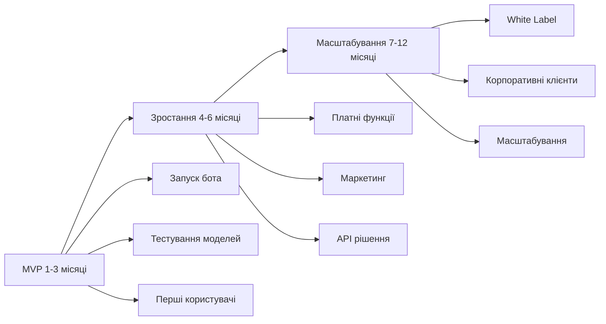

# AI Video Bot: Аналіз монетизації

## 📋 Зміст
- [Моделі монетизації](#моделі-монетизації)
- [Аналіз ринку](#аналіз-ринку)
- [Бізнес-план](#бізнес-план)
- [Плюси та мінуси моделей](#плюси-та-мінуси-моделей)

---

## Моделі монетизації

### A. Прямі моделі (B2C)

| Модель | Опис | Ціновий діапазон |
|--------|------|------------------|
| **Telegram Stars** | Внутрішня валюта Telegram для оплати послуг | 50-500 Stars/міс |
| **Pay-per-video** | Оплата за кожне згенероване відео | $0.10-0.50/відео |
| **Freemium** | Безкоштовні ліміти + преміум функції | $5-20/міс |
| **Донати** | Добровільні внески через ботів | Невизначено |

### B. B2B моделі

| Модель | Опис | Потенціал |
|--------|------|-----------|
| **API для розробників** | SaaS рішення для інтеграції | $100-1000/міс |
| **White Label** | Готове рішення під брендом клієнта | $500-5000/проект |
| **Корпоративні рішення** | Навчальні відео, презентації | $200-2000/замовлення |

### C. Контент-моделі

| Модель | Опис | Потенціал доходу |
|--------|------|------------------|
| **YouTube канал** | Автоматичний контент | $1-5/1000 переглядів |
| **TikTok/Reels** | Короткі відео | $0.02-0.05/1000 переглядів |
| **Аудіокниги** | Озвучення текстів | $5-20/книга |

---

## Аналіз ринку

### Конкуренти

| Сервіс | Ціна | Переваги | Недоліки |
|--------|------|----------|----------|
| **ElevenLabs** | $5-99/міс | Найкраща якість голосу | Дорого, англійські голоси |
| **Murf.ai** | $19-99/міс | Професійні голоси | Обмежені мови |
| **Play.ht** | $31-99/міс | Багато голосів | Складний інтерфейс |
| **OpenAI TTS** | $15/1M символів | Простота | Шаблонні голоси |

### Унікальна ціннісна пропозиція (USP)

```
✅ Qwen3-TTS VoiceDesign - генерація голосів за описом
✅ Підтримка української/російської мов
✅ Повна автоматизація: текст → відео
✅ Багатоголоса озвучка
✅ Низька собівартість ($30-60/міс)
```

### Цільова аудиторія

| Сегмент | Опис | Платоспроможність |
|---------|------|-------------------|
| Контент-кріейтори | YouTube, TikTok блогери | Середня |
| Маркетологи | Створення рекламних роликів | Висока |
| Освіта | Навчальні матеріали | Середня |
| SMM-менеджери | Контент для соцмереж | Середня |
| Підприємці | Презентації, промо-відео | Висока |

---

## Бізнес-план

### Структура витрат

| Стаття | MVP | Продакшен |
|--------|-----|-----------|
| GPU сервер (RunPod) | $30-60/міс | $100-150/міс |
| Gemini API | $5-20/міс | $50-100/міс |
| Домен + хостинг | $5/міс | $20/міс |
| **Разом** | **$40-85/міс** | **$170-270/міс** |

### Точка беззбитковості

```
При витратах $100/міс:
- Pay-per-video ($0.20): 500 відео/міс
- Підписка ($10): 10 підписників
- API ($100): 1 клієнт
```

### Прогноз доходів

| Сценарій | Місяць 1-3 | Місяць 4-6 | Місяць 7-12 |
|----------|------------|------------|-------------|
| Песимістичний | $0-50 | $50-100 | $100-300 |
| Реалістичний | $50-150 | $200-500 | $500-1500 |
| Оптимістичний | $100-300 | $500-1000 | $1500-5000 |

### Етапи розвитку



---

## Плюси та мінуси моделей

### Telegram Stars / Підписка

| Переваги | Недоліки |
|----------|----------|
| ✅ Простота впровадження | ❌ Комісія Telegram 15-30% |
| ✅ Вбудована аудиторія | ❌ Обмежені ціни |
| ✅ Автоматичні платежі | ❌ Залежність від платформи |

### Pay-per-video

| Переваги | Недоліки |
|----------|----------|
| ✅ Оплата за використання | ❌ Нестабільний дохід |
| ✅ Низький поріг входу | ❌ Потрібна критична маса |
| ✅ Прозорість для клієнта | ❌ Важко прогнозувати |

### Freemium

| Переваги | Недоліки |
|----------|----------|
| ✅ Швидкий ріст бази | ❌ Високі витрати на безкоштовних |
| ✅ Конверсія в платних | ❌ Потрібен баланс лімітів |
| ✅ Популярна модель | ❌ Конкуренція |

### API для розробників

| Переваги | Недоліки |
|----------|----------|
| ✅ Високий ARPU | ❌ Технічна підтримка |
| ✅ B2B стабільність | ❌ Документація |
| ✅ Масштабованість | ❌ Складність впровадження |

### White Label

| Переваги | Недоліки |
|----------|----------|
| ✅ Високий чек | ❌ Великий цикл продажу |
| ✅ Довгострокові контракти | ❌ Кастомізація |
| ✅ Репутація | ❌ Підтримка клієнтів |

### Контент-моделі (YouTube/TikTok)

| Переваги | Недоліки |
|----------|----------|
| ✅ Пасивний дохід | ❌ Висока конкуренція |
| ✅ Маркетинг продукту | ❌ Тривалий вихід на дохід |
| ✅ Демонстрація можливостей | ❌ Залежність від алгоритмів |

---

## Рекомендації

### Пріоритет моделей для MVP

1. **Freemium** - основна модель для залучення користувачів
2. **Pay-per-video** - для разових користувачів
3. **Telegram Stars** - для простих платежів

### Для масштабування

1. **API для розробників** - стабільний B2B дохід
2. **White Label** - великі проекти
3. **YouTube канал** - маркетинг + пасивний дохід

---

*Документ створено: 2026-02-14*
