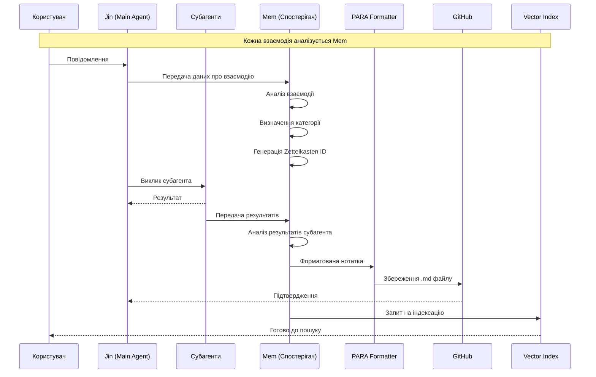

# План автоматизації "другого мозку" для Jin

## Огляд завдання

Створити систему автоматизації яка:
1. Jin (основний AI агент) викликає Mem (субагент) для збереження нотаток
2. Mem (субагент) автоматично створює `.md` файли з запитів та відповідей
3. Використовує методології Zettelkasten, PARA та CODE
4. Зберігає в GitHub репозиторій
5. Автоматично індексує для векторного пошуку

## Архітектура: Jin → Mem

```mermaid
graph TB
    subgraph "Jin (Main Agent)"
        JA[Jin AI Agent]
        MC[Mem Call - виклик субагента]
    end
    
    subgraph "Mem (Subagent)"
        MA[Mem Subagent]
        WH[Webhook Handler]
        PF[PARA Formatter]
        ZK[Zettelkasten ID Generator]
    end
    
    subgraph "OpenClaw"
        OC[OpenClaw Gateway]
        ES[Embedding System]
    end
    
    subgraph Storage
        MD[Markdown Files]
        GH[GitHub Repo]
        VE[Vector Embeddings]
    end
    
    JA --> MC
    MC --> MA
    MA --> WH
    WH --> PF
    PF --> ZK
    ZK --> MD
    MD --> GH
    MA --> VE
    VE --> ES
    OC -.->|webhook| MC

---

## Компоненти плану

### 1. Jin - основний агент

**Призначення:** Координація роботи з користувачем та виклик Mem субагента

**Завдання:**
- Обробка запитів користувача
- Аналіз контенту на необхідність збереження
- Виклик Mem субагента
- Координація інших агентів

### 2. Mem - субагент для роботи з нотатками

**Призначення:** Автоматичне створення нотаток у форматі PARA + Zettelkasten

**Завдання:**
- Отримання даних від Jin
- Парсинг та категоризація контенту
- Генерація Zettelkasten ID
- Форматування markdown файлів
- Збереження в правильну директорію
- Запит на векторну індексацію

**Технології:**
- Python (рекомендовано для інтеграції з Kilo_Code)
- Jinja2 templates для форматування

### 2. Система PARA + Zettelkasten

**Структура файлів:**

```
brain/
├── 000-inbox/              # Inbox - неструктуровані нотатки
│   └── inbox.md
├── 100-projects/           # Projects - активні проєкти
│   ├── p-001-project-name/
│   │   ├── metadata.yaml
│   │   └── notes/
│   │       └── 20260227-001.md
│   └── ...
├── 200-areas/             # Areas - сфери відповідальності
│   ├── a-001-area-name/
│   │   ├── metadata.yaml
│   │   └── notes/
│   └── ...
├── 300-resources/          # Resources - ресурси для вивчення
│   ├── r-001-topic/
│   │   ├── metadata.yaml
│   │   └── notes/
│   └── ...
├── 400-archives/           # Archives - архівні нотатки
│   └── ...
├── 500-evergreens/         # Zettelkasten - постійні нотатки
│   ├── 20260227-001-title/
│   │   ├── index.md
│   │   ├── links.md
│   │   └── outlinks.md
│   └── ...
├── memory/                 # Daily notes
│   └── YYYY-MM-DD.md
├── skills/                 # Навички агентів
│   └── ...
├── MEMORY.md               # Основна пам'ять
├── README.md
└── .github/
    └── workflows/
        └── sync.yml        # GitHub Actions для sync
```

**Завдання:**
- Створити систему нумерації (100-projects, 200-areas, etc.)
- Реалізувати генерацію Zettelkasten ID (YYYYMMDD-XXX)
- Налаштувати шаблони файлів з frontmatter
- Створити систему лінків (links, outlinks, backlinks)

**Шаблон Zettelkasten нотатки:**

```markdown
---
id: 20260227-001
title: "Заголовок нотатки"
created: 2026-02-27T10:00:00Z
updated: 2026-02-27T10:00:00Z
type: evergreen
tags: [tag1, tag2]
links: [20260226-001, 20260225-003]
---

# Заголовок нотатки

Основний контент нотатки...

## Посилання
- [[20260226-001]] - Посилання на пов'язану нотатку

## Джерела
- Посилання на джерела інформації
```

### 3. GitHub синхронізація

**Механізм:** GitHub Actions + SSH deploy key

**Завдання:**
- Налаштувати SSH ключ для автоматичного push
- Створити GitHub Actions workflow
- РеалізуватиDebounced commit (групування змін)
- Налаштувати автоматичний sync кожні N хвилин

**GitHub Actions workflow:**

```yaml
name: Sync Second Brain
on:
  push:
    branches: [local]
  schedule:
    - cron: '*/15 * * * *'  # Кожні 15 хвилин
  workflow_dispatch:

jobs:
  sync:
    runs-on: ubuntu-latest
    steps:
      - name: Checkout
        uses: actions/checkout@v4
        with:
          ssh-key: ${{ secrets.SSH_PRIVATE_KEY }}
          persist-credentials: true

      - name: Pull latest
        run: |
          git config user.name "Jin Bot"
          git config user.email "jin@second-brain.local"
          git pull origin main || true

      - name: Commit changes
        run: |
          git add .
          git diff --cached --quiet || git commit -m "Update: $(date)"

      - name: Push
        if: github.event_name != 'pull_request'
        run: git push origin local:main
```

### 4. Векторна індексація (OpenClaw Embeddings)

**Призначення:** Семантичний пошук по нотатках

**Завдання:**
- Інтегруватися з вбудованим embedding system OpenClaw
- Створити Python скрипт для індексації нових файлів
- Налаштувати автоматичну індексацію при створенні файлів
- Забезпечити оновлення векторів при зміні нотаток

**Скрипт індексації:**

```python
#!/usr/bin/env python3
"""
Jin Embeddings Indexer
Індексує markdown файли для векторного пошуку в OpenClaw
"""

import os
import json
from pathlib import Path
from datetime import datetime

# Конфігурація
EMBEDDINGS_DIR = '/root/.openclaw/workspace/memory'
BRAIN_DIR = '/path/to/brain-second-brain'

def get_openclaw_embeddings_config():
    """Отримує конфігурацію embeddings з OpenClaw"""
    # TODO: Реалізувати через OpenClaw API
    pass

def index_file(filepath: str) -> dict:
    """Індексує окремий файл"""
    with open(filepath, 'r', encoding='utf-8') as f:
        content = f.read()
    
    # TODO: Викликати OpenClaw embeddings API
    # embedding = openclaw.embed(content)
    
    return {
        'file': filepath,
        'indexed_at': datetime.utcnow().isoformat(),
        'status': 'success'
    }

def main():
    """Основна функція індексації"""
    brain_path = Path(BRAIN_DIR)
    
    # Знайти всі .md файли
    md_files = list(brain_path.rglob('*.md'))
    
    for filepath in md_files:
        result = index_file(str(filepath))
        print(f"Indexed: {filepath}")
    
    print(f"Total: {len(md_files)} files")
```

---

## Jin (основний агент) та Mem (субагент)

### Ролі:

**Jin (основний агент)** - AI агент, який:
- Обробляє запити користувача
- Викликає різні субагентів для виконання завдань
- Координує роботу між іншими агентами
- Взаємодіє з користувачем

**Mem (субагент - "Спостерігач")** - спеціалізований агент для аналізу взаємодій:
- Аналізує ВСІ взаємодії в системі:
  - Взаємодію користувача з Jin (основним агентом)
  - Взаємодію Jin з іншими субагентами
  - Виклики та результати роботи субагентів
- Автоматично викликається при кожній взаємодії
- Створює структуровані нотатки про:
  - Які субагенти викликалися
  - Які завдання виконувалися
  - Які результати були отримані
- Зберігає інформацію в PARA + Zettelkasten форматі
- Індексує для векторного пошуку

### Що аналізує Mem:

```mermaid
graph LR
    subgraph "Взаємодії в системі"
        U[Користувач]
        J[Jin - Основний агент]
        S1[Субагент 1]
        S2[Субагент 2]
        S3[Субагент N]
        M[Mem - Спостерігач]
    end
    
    U <-> J: Запит/відповідь
    J <-> S1: Виклик/результат
    J <-> S2: Виклик/результат
    J <-> S3: Виклик/результат
    
    M -.->|Аналізує всі| U
    M -.->|Аналізує всі| J
    M -.->|Аналізує всі| S1
    M -.->|Аналізує всі| S2
    M -.->|Аналізує всі| S3
```

### Нотатки, які створює Mem:

1. **Взаємодія з користувачем** - що запитував, що відповів Jin
2. **Виклики субагентів** - який субагент, з якими параметрами
3. **Результати** - що повернув субагент
4. **Ланцюжок думок** - як Jin приймав рішення
5. **Помилки** - що пішло не так

### Workflow: Всі взаємодії проходять через Mem



### Як Jin викликає Mem:

```
MEM ANALYZE
Interaction: user_to_jin
User: Повідомлення користувача...
JinResponse: Відповідь Jin...
---

MEM ANALYZE
Interaction: jin_to_subagent
Subagent: brain-jazz
Input: Параметри виклику...
Output: Результат роботи...
---

MEM ANALYZE
Interaction: subagent_chain
Chain: [brain -> voice -> memory]
Results: [result1, result2, result3]
```
---

## Пріоритети реалізації

### Phase 1: Базова інфраструктура
1. Налаштування SSH/GitHub sync
2. Створення структури PARA директорій
3. Базовий webhook endpoint
4. Шаблони файлів

### Phase 2: Jin Agent
1. Jin system prompt
2. Інтеграція з OpenClaw
3. Логіка категоризації
4. Генерація Zettelkasten ID

### Phase 3: Векторна індексація
1. Інтеграція з OpenClaw embeddings
2. Автоматична індексація
3. Semantic search endpoint

### Phase 4: Розширені функції
1. Backlinks система
2. Graph view (Obsidian-style)
3. AI-powered linking suggestions

---

## Технічні деталі

### Фронтенд/API

| Компонент | Технологія | Опис |
|-----------|------------|------|
| Webhook Server | FastAPI (Python) | Обробка подій від OpenClaw |
| File Processor | Python | Парсинг markdown, генерація ID |
| Git Sync | GitHub Actions + SSH | Автоматичний push |
| Embeddings | OpenClaw built-in | Vector search |

### Конфігурація

```yaml
# jin-config.yaml
jin:
  webhook:
    port: 8080
    auth_token: ${JIN_WEBHOOK_TOKEN}
  
  brain:
    path: /path/to/brain-second-brain
    para_structure: true
    zettelkasten: true
  
  github:
    repo: vadymvertyan-stack/brain-second-brain
    branch: local
    ssh_key: /root/.ssh/jin_deploy
  
  embeddings:
    provider: openclaw
    model: ada-002
    auto_index: true
```

---

## Очікувані результати

1. **Автоматизація:** Jin автоматично створює нотатки без ручного втручання
2. **Структурованість:** Використання PARA + Zettelkasten забезпечує організацію
3. **Пошук:** Векторна індексація дозволяє семантичний пошук
4. **Синхронізація:** GitHub забезпечує резервне копіювання та версіонування

---

## Наступні кроки

1. Підтвердити план
2. Почати реалізацію Phase 1
3. Налаштувати GitHub repository та SSH keys
4. Створити базову структуру PARA
5. Розробити webhook endpoint
