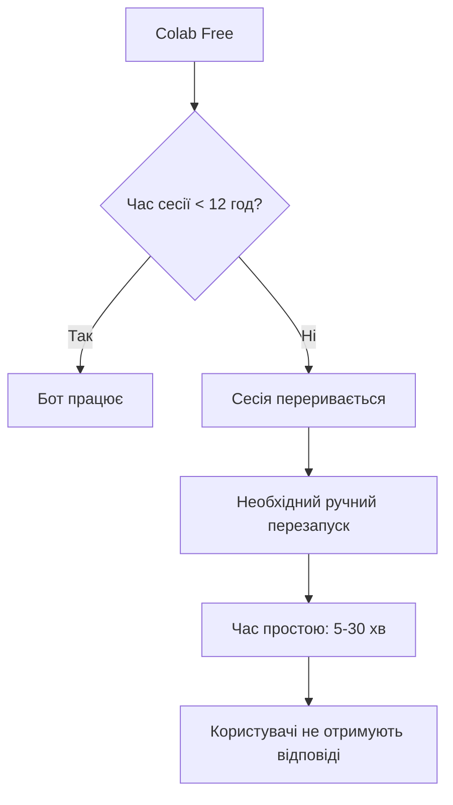
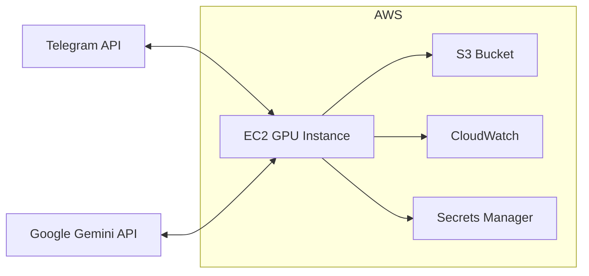
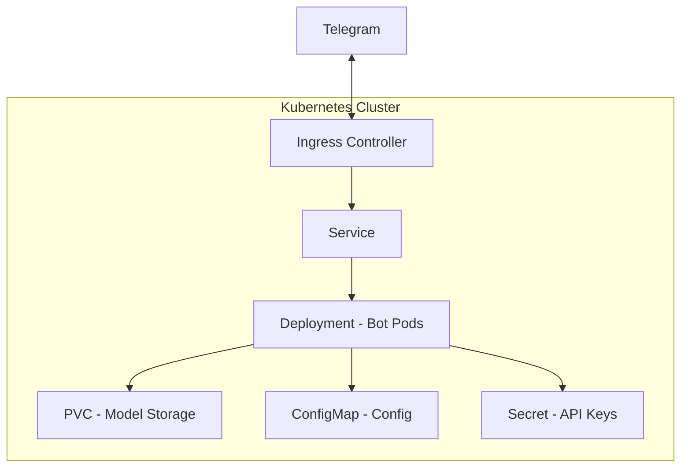
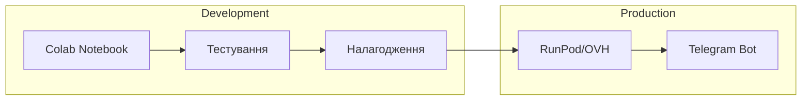
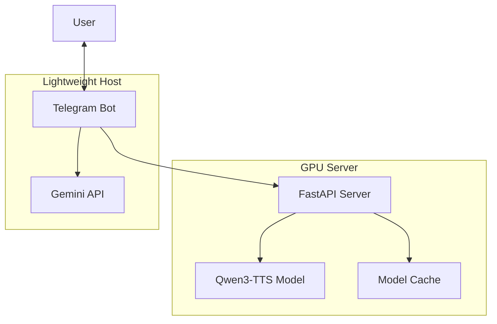
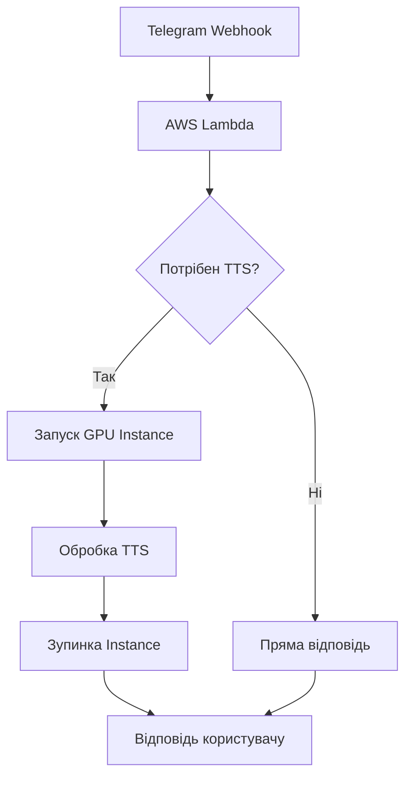
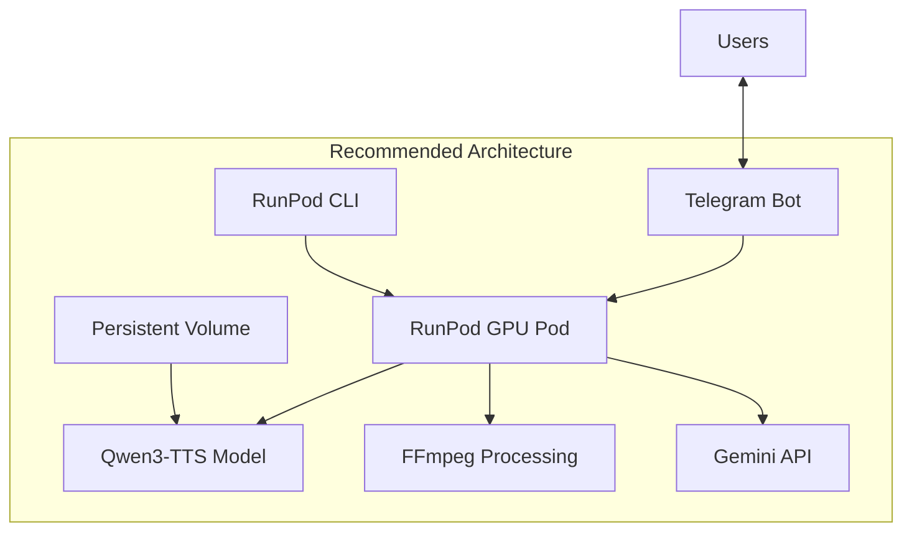

# VIBEMODLY AI Studio: Архітектурний аналіз варіантів розгортання

## 📋 Зміст
- [Вступ](#вступ)
- [Технічні вимоги проекту](#технічні-вимоги-проекту)
- [Варіант 1: Google Colab](#варіант-1-google-colab)
- [Варіант 2: VPS/VDS сервери](#варіант-2-vpsvds-сервери)
- [Варіант 3: Хмарні рішення](#варіант-3-хмарні-рішення)
- [Варіант 4: Гібридні підходи](#варіант-4-гібридні-підходи)
- [Порівняльна таблиця](#порівняльна-таблиця)
- [Рекомендації](#рекомендації)
- [Висновки](#висновки)

---

## Вступ

**VIBEMODLY AI Studio** - це Telegram-бот на базі AI, який перетворює текстові сюжети на міні-відео з багатоголосою озвучкою. Цей документ аналізує різні варіанти розгортання системи з урахуванням технічних вимог, вартості та масштабованості.

### Технічний стек проекту

| Компонент | Технологія | Вимоги до ресурсів |
|-----------|------------|-------------------|
| AI-мозок | Google Gemini 2.5 Flash | API, без локальних ресурсів |
| TTS | Qwen3-TTS 1.7B VoiceDesign | ~4GB VRAM, GPU прискорення |
| Візуал | PIL | CPU, мінімальні ресурси |
| Монтаж | FFmpeg | CPU, залежить від тривалості відео |
| Інтерфейс | pyTelegramBotAPI | Мінімальні ресурси |

---

## Технічні вимоги проекту

### Мінімальні вимоги до обладнання

```
CPU: 4+ ядра (для FFmpeg та паралельної обробки)
RAM: 8GB мінімум, 16GB рекомендовано
GPU: NVIDIA з CUDA підтримкою
VRAM: 4GB мінімум для Qwen3-TTS 1.7B
Диск: 20GB+ (модель + тимчасові файли + кеш)
Мережа: Стабільне з'єднання для Telegram API
```

### Рекомендації для Qwen3-TTS 1.7B

| Режим | VRAM | RAM | Примітки |
|-------|------|-----|----------|
| FP16 (повна точність) | 4-5GB | 8GB | Найкраща якість |
| INT8 (квантована) | 2.5-3GB | 6GB | Компроміс якості |
| INT4 (агресивна квантизація) | 1.5-2GB | 4GB | Прийнятна якість |

---

## Варіант 1: Google Colab

### Огляд

Google Colab - поточне рішення для розгортання VIBEMODLY AI Studio. Це безкоштовне хмарне середовище з доступом до GPU.

### Переваги

| Перевага | Опис |
|----------|------|
| ✅ Безкоштовний доступ до GPU | T4 GPU безкоштовно, A100/V100 для Premium |
| ✅ Швидкий старт | Налаштоване середовище, готові образи |
| ✅ Інтеграція з Google Drive | Зручне зберігання моделей та даних |
| ✅ Jupyter Notebook інтерфейс | Зручність розробки та налагодження |
| ✅ Попередньо встановлені бібліотеки | PyTorch, TensorFlow, CUDA |

### Недоліки

| Недолік | Опис | Вплив на проект |
|---------|------|-----------------|
| ❌ Обмежений час сесії | 12 годин (free), 24 години (Pro) | Необхідність перезапуску бота |
| ❌ GPU ліміти | Залежить від завантаженості | Чекання доступу до GPU |
| ❌ Дисконнекти | При неактивності | Втрата стану бота |
| ❌ Нестабільність | Можливі перерви | Незадоволені користувачі |
| ❌ Відсутність SLA | Жодних гарантій | Непридатно для продакшену |

### Тарифи Google Colab

| План | Вартість | GPU | Час сесії | RAM |
|------|----------|-----|-----------|-----|
| Free | $0/міс | T4 (обмежено) | 12 год | 12GB |
| Pro | $10/міс | T4, пріоритет | 24 год | 32GB |
| Pro+ | $50/міс | A100, V100 | 24+ год | 84GB |

### Обмеження для продакшену



### Висновок по Colab

**Придатність:** Тільки для розробки та тестування

**Не рекомендується для продакшену через:**
- Непередбачувані перерви в роботі
- Відсутність гарантій доступності
- Необхідність постійного моніторингу

---

## Варіант 2: VPS/VDS сервери

### Огляд

Власний виділений сервер з GPU забезпечує повний контроль над ресурсами та стабільність роботи.

### Вимоги до GPU для Qwen3-TTS 1.7B

| GPU модель | VRAM | Продуктивність | Придатність |
|------------|------|----------------|-------------|
| RTX 3060 | 12GB | Базова | ✅ Рекомендовано |
| RTX 4060 Ti | 16GB | Середня | ✅ Оптимально |
| RTX 3090 | 24GB | Висока | ✅ Overkill, але добре |
| RTX 4090 | 24GB | Дуже висока | ⚠️ Занадто дорого |
| T4 | 16GB | Середня | ✅ Хороший варіант |
| A10 | 24GB | Висока | ✅ Для масштабування |

### Порівняння хостинг-провайдерів

#### Hetzner

| Параметр | Значення |
|----------|----------|
| GPU сервери | Немає власних GPU |
| VPS | CCX серія, до 16 vCPU |
| Вартість | €4-40/міс (CPU only) |
| Розташування | Німеччина, Фінляндія |
| **Висновок** | ❌ Не підходить для GPU |

#### OVH

| Параметр | Значення |
|----------|----------|
| GPU сервери | Є (NVIDIA GPU) |
| Моделі | T4, A10, A100 |
| Вартість | від €0.80/год |
| Розташування | Франція, Німеччина, Канада |
| **Висновок** | ✅ Гарний варіант |

#### RunPod

| Параметр | Значення |
|----------|----------|
| Спеціалізація | GPU для AI/ML |
| Моделі | RTX 3090, 4090, A100, H100 |
| Вартість | від $0.20/год (RTX 3090) |
| Особливості | Spot instances до 80% дешевше |
| **Висновок** | ✅✅ Оптимальний вибір |

#### Lambda Labs

| Параметр | Значення |
|----------|----------|
| Спеціалізація | AI інфраструктура |
| Моделі | RTX 3090, 4090, A100, H100 |
| Вартість | від $0.50/год |
| Особливості | Готові ML образи |
| **Висновок** | ✅ Гарний варіант |

#### AWS EC2 GPU Instances

| Тип інстансу | GPU | Вартість/год | Придатність |
|--------------|-----|--------------|-------------|
| g4dn.xlarge | T4 | $0.526 | ✅ Базовий |
| g5.xlarge | A10G | $1.006 | ✅ Рекомендовано |
| p3.2xlarge | V100 | $3.06 | ⚠️ Дорого |
| p4d.24xlarge | A100 x4 | $32.77 | ❌ Overkill |

### Детальний розрахунок вартості

#### RunPod - Рекомендований варіант

```
Конфігурація: RTX 3090 (24GB VRAM)
Тип: Pod (контейнер)

Варіанти оплати:
┌─────────────────┬────────────┬─────────────┐
│ Тип             │ Ціна/год   │ Ціна/міс    │
├─────────────────┼────────────┼─────────────┤
│ On-demand       │ $0.20      │ ~$144       │
│ Spot            │ $0.04-0.08 │ ~$29-58     │
│ Reserved        │ $0.14      │ ~$101       │
└─────────────────┴────────────┴─────────────┘

Додаткові витрати:
- Storage: $0.10/GB/міс
- Bandwidth: $0.01/GB
```

#### OVH AI Deploy

```
Конфігурація: NVIDIA T4 (16GB)
Тип: AI Instances

Вартість:
┌─────────────────┬────────────┬─────────────┐
│ Тип             │ Ціна/год   │ Ціна/міс    │
├─────────────────┼────────────┼─────────────┤
│ ai-1-t4-1       │ €0.80      │ ~€576       │
│ ai-1-a10-1      │ €1.60      │ ~€1152      │
└─────────────────┴────────────┴─────────────┘
```

### Купівля vs Оренда

#### Купівля власного сервера

| Компонент | Вартість |
|-----------|----------|
| RTX 3060 12GB | $300-400 |
| RTX 4060 Ti 16GB | $450-550 |
| Материнська плата + CPU | $200-300 |
| RAM 32GB | $80-120 |
| SSD 1TB | $60-100 |
| Блок живлення 750W | $80-120 |
| Корпус + охолодження | $100-150 |
| **Разом (RTX 3060)** | **$820-1190** |
| **Разом (RTX 4060 Ti)** | **$970-1340** |

**Переваги купівлі:**
- Окупність за 6-12 місяців
- Повний контроль
- Можливість апгрейду

**Недоліки купівлі:**
- Високі початкові витрати
- Відповідальність за обслуговування
- Витрати на електроенергію (~$30-50/міс)
- Шум та тепло

---

## Варіант 3: Хмарні рішення

### AWS з GPU інстансами

#### Архітектура розгортання



#### Компоненти та вартість

| Сервіс | Конфігурація | Вартість/міс |
|--------|--------------|--------------|
| EC2 g5.xlarge | A10G GPU, 4 vCPU, 16GB | $724 (on-demand) |
| EBS gp3 | 50GB | $5 |
| S3 | 10GB | $0.23 |
| Data Transfer | 100GB | $9 |
| CloudWatch | Базовий | $5 |
| **Разом** | | **~$743/міс** |

#### Spot Instances для економії

```
Spot Instance g5.xlarge: ~$0.30/год (vs $1.00 on-demand)
Економія: до 70%

Ризики:
- Миттєве переривання (2 хв попередження)
- Нестабільна доступність
```

### Google Cloud Platform

| Сервіс | Конфігурація | Вартість/міс |
|--------|--------------|--------------|
| GCE n1-standard-4 + T4 | 4 vCPU, 15GB, T4 | ~$400 |
| Persistent Disk | 50GB | $2 |
| Cloud Storage | 10GB | $0.23 |
| **Разом** | | **~$402/міс** |

### Azure

| Сервіс | Конфігурація | Вартість/міс |
|--------|--------------|--------------|
| NC4as T4 v3 | 4 vCPU, 28GB, T4 | ~$520 |
| Managed Disk | 50GB | $3 |
| Blob Storage | 10GB | $0.20 |
| **Разом** | | **~$523/міс** |

### Serverless варіанти

#### AWS Lambda + EFS (для моделі)

```
Обмеження Lambda:
- Максимальний час виконання: 15 хв
- Максимальна пам'ять: 10GB
- Немає GPU підтримки

Висновок: ❌ Не підходить для TTS з GPU
```

#### Альтернатива: AWS SageMaker Endpoints

| Конфігурація | Вартість/год | Примітки |
|--------------|--------------|----------|
| ml.g4dn.xlarge | $0.736 | T4 GPU |
| ml.g5.xlarge | $1.403 | A10G GPU |

**Переваги:**
- Автоматичне масштабування
- Готові контейнери
- Model monitoring

**Недоліки:**
- Висока вартість
- Cold start для рідких запитів

### Контейнеризація

#### Docker конфігурація

```dockerfile
# Приклад Dockerfile для VIBEMODLY
FROM nvidia/cuda:11.8-cudnn8-runtime-ubuntu22.04

# Встановлення Python та залежностей
RUN apt-get update && apt-get install -y \
    python3.10 \
    python3-pip \
    ffmpeg \
    && rm -rf /var/lib/apt/lists/*

# Встановлення PyTorch з CUDA
RUN pip install torch torchvision torchaudio --index-url https://download.pytorch.org/whl/cu118

# Копіювання проекту
COPY . /app
WORKDIR /app

# Завантаження моделі при старті
RUN python -c "from transformers import AutoModel; AutoModel.from_pretrained('Qwen/Qwen3-TTS-1.7B')"

CMD ["python", "bot.py"]
```

#### Kubernetes архітектура



**Ресурси для K8s:**

```yaml
resources:
  requests:
    memory: "8Gi"
    cpu: "2"
    nvidia.com/gpu: 1
  limits:
    memory: "16Gi"
    cpu: "4"
    nvidia.com/gpu: 1
```

---

## Варіант 4: Гібридні підходи

### Підхід 1: Colab для розробки + VPS для продакшену



**Переваги:**
- Безкоштовна розробка
- Стабільний продакшен
- Гнучкість

**Вартість:** $30-150/міс (тільки продакшен)

### Підхід 2: API-обгортка навколо моделі



**Архітектура:**

| Компонент | Хостинг | Вартість/міс |
|-----------|---------|--------------|
| GPU Server (TTS API) | RunPod Spot | $30-60 |
| Telegram Bot | Vercel/Railway | $0-5 |
| Gemini API | Google Cloud | Pay per use |

**Переваги:**
- Розділення відповідальності
- Можливість масштабування TTS окремо
- Економія на GPU часі (тільки при запитах)

### Підхід 3: Serverless + GPU on-demand



**Реалізація:**

1. Lambda обробляє прості запити
2. При потребі TTS - запускається GPU інстанс
3. Після обробки - інстанс зупиняється

**Вартість:** $20-100/міс (залежно від навантаження)

### Підхід 4: Модель-як-сервіс

**Використання готових TTS API:**

| Сервіс | Якість | Вартість |
|--------|--------|----------|
| ElevenLabs | Висока | $5-99/міс |
| OpenAI TTS | Висока | $15/1M символів |
| Google TTS | Середня | $4/1M символів |
| Azure TTS | Висока | $15/1M символів |

**Порівняння з власною моделлю:**

```
Власна модель Qwen3-TTS:
- Фіксована вартість сервера: $30-150/міс
- Необмежена кількість запитів
- Повний контроль якості

Готовий API:
- Оплата за використання
- Швидкий старт
- Залежність від провайдера
```

---

## Порівняльна таблиця

### Зведена таблиця варіантів

| Критерій | Colab Free | Colab Pro | RunPod Spot | RunPod On-demand | OVH | AWS EC2 | Власний сервер |
|----------|------------|-----------|-------------|------------------|-----|---------|----------------|
| **Вартість/міс** | $0 | $10 | $30-60 | $100-150 | $200-400 | $400-700 | $50-100* |
| **GPU** | T4 | T4/A100 | RTX 3090 | RTX 3090 | T4/A10 | T4/A10G | RTX 3060/4060 |
| **VRAM** | 16GB | 16-40GB | 24GB | 24GB | 16-24GB | 16-24GB | 12-16GB |
| **Стабільність** | ❌ Низька | ⚠️ Середня | ⚠️ Середня | ✅ Висока | ✅ Висока | ✅ Висока | ✅ Висока |
| **SLA** | ❌ Немає | ❌ Немає | ⚠️ Частковий | ✅ Є | ✅ Є | ✅ Є | ❌ Немає |
| **Масштабованість** | ❌ | ❌ | ✅ | ✅ | ✅ | ✅✅ | ❌ |
| **Налаштування** | ✅ Просте | ✅ Просте | ⚠️ Середнє | ⚠️ Середнє | ⚠️ Складне | ❌ Складне | ❌ Складне |
| **Підтримка** | ❌ | ⚠️ | ✅ | ✅ | ✅ | ✅✅ | ❌ |

*Власний сервер: електроенергія + амортизація

### Вартість за сценаріями використання

| Сценарій | Запитів/день | Colab | RunPod Spot | RunPod On-demand | API сервіси |
|----------|--------------|-------|-------------|------------------|-------------|
| Хобі проект | 10-50 | ✅ $0 | $10-20 | $30-50 | $5-15 |
| Малий бізнес | 100-500 | ❌ Нестабільно | $30-60 | $100-150 | $30-100 |
| Середній бізнес | 500-2000 | ❌ | $60-120 | $200-300 | $100-300 |
| Великий проект | 5000+ | ❌ | $150+ | $500+ | $500+ |

---

## Рекомендації

### За сценаріями використання

#### 🎯 Сценарій 1: Хобі проект / MVP

**Рекомендація:** Google Colab Free + моніторинг

```
Конфігурація:
- Colab Free з T4 GPU
- Автоматичний перезапуск через Colab snippets
- Telegram повідомлення при дисконнекті

Вартість: $0/міс
Обмеження: До 50 запитів/день
```

#### 🚀 Сценарій 2: Стартап / Малий бізнес

**Рекомендація:** RunPod Spot Instances

```
Конфігурація:
- RTX 3090 Spot Instance
- Persistent Volume для моделі
- Auto-restart при перериванні

Вартість: $30-60/міс
Надійність: 85-95% uptime
```

#### 🏢 Сценарій 3: Продакшен / Бізнес

**Рекомендація:** RunPod On-demand або OVH

```
Конфігурація:
- Виділений GPU інстанс
- SLA гарантії
- Моніторинг та алерти

Вартість: $100-400/міс
Надійність: 99%+ uptime
```

#### 🏭 Сценарій 4: Ентерпрайз / Високе навантаження

**Рекомендація:** AWS/GCP з Kubernetes

```
Конфігурація:
- Kubernetes кластер
- Auto-scaling
- Multi-region deployment
- CDN для відео

Вартість: $500-2000/міс
Надійність: 99.9%+ uptime
```

### Рекомендована архітектура для VIBEMODLY



**Компоненти:**

| Компонент | Рішення | Вартість |
|-----------|---------|----------|
| GPU хостинг | RunPod RTX 3090 Spot | $30-60/міс |
| Сховище | RunPod Network Volume 50GB | $5/міс |
| AI мозок | Google Gemini API | Pay per use |
| Моніторинг | RunPod + UptimeRobot | Безкоштовно |
| **Разом** | | **$35-65/міс** |

---

## Висновки

### Ключові рекомендації

1. **Для розробки:** Google Colab Free - ідеально для тестування та налагодження

2. **Для запуску MVP:** RunPod Spot Instances - оптимальне співвідношення ціна/якість

3. **Для продакшену:** RunPod On-demand або OVH - стабільність та передбачуваність

4. **Для масштабування:** AWS/GCP з контейнеризацією - гнучкість та надійність

### Наступні кроки

1. ✅ Протестувати RunPod з Spot Instance
2. ✅ Налаштувати Docker контейнер для VIBEMODLY
3. ✅ Реалізувати persistent storage для моделі
4. ✅ Додати моніторинг та алерти
5. ✅ Документувати процес деплою

### Фінальна порада

> Для VIBEMODLY AI Studio на поточному етапі рекомендую **RunPod Spot Instances з RTX 3090**. Це забезпечить:
> - Достатньо VRAM (24GB) для Qwen3-TTS та майбутніх моделей
> - Прийнятну вартість ($30-60/міс)
> - Можливість масштабування
> - Готову інфраструктуру для AI/ML

---

*Документ створено: 2026-02-14*  
*Автор: Kilo Code Architect*
