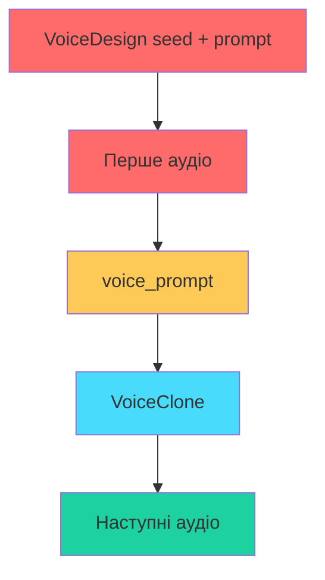
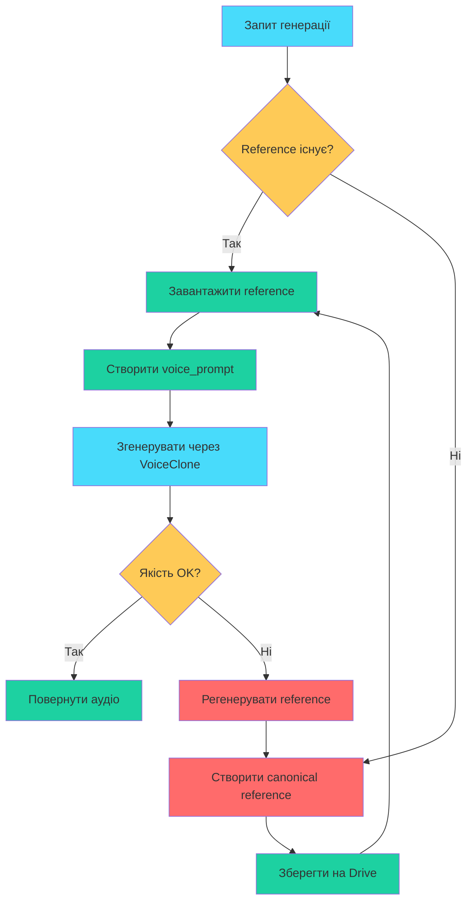

# VIBEMODLY: Аналіз та вирішення проблеми консистентності голосів

## 📋 Поточна ситуація

### Версія: v69.0
### Проблема: Голоси героїв та диктора не консистентні між різними репліками

---

## 🔍 Корінні причини проблеми

### 1. Фундаментальна проблема VoiceDesign

```
Поточний алгоритм:
1. Перший виклик: VoiceDesign(seed + prompt) → аудіо
2. Збереження voice_prompt з першого аудіо
3. Наступні виклики: VoiceClone(voice_prompt)
```

**Проблема:** VoiceDesign у Qwen3-TTS не створює стабільний голос навіть з фіксованим seed:

- Seed впливає тільки на випадкові аспекти генерації
- Текстовий prompt інтерпретується по-різному для різних текстів
- Голос "плаває" між репліками

### 2. Проблема VoiceClone

VoiceClone залежить від якості reference аудіо:

- Reference береться з ПЕРШОГО згенерованого аудіо
- Перший текст може бути коротким або нехарактерним
- Якість клонування погіршується

### 3. Архітектурна проблема



**Червоним** позначено ненадійні елементи:
- VoiceDesign не гарантує консистентність
- Перше аудіо може бути низької якості

---

## 🎯 Альтернативні підходи

### Підхід A: Pre-generated Voice Library

**Ідея:** Згенерувати якісні reference аудіо заздалегідь

```
Алгоритм:
1. Для кожного персонажа згенерувати 10-15 секунд "canonical" аудіо
2. Зберегти на Google Drive як reference
3. Використовувати ТІЛЬКИ VoiceClone для всіх генерацій
```

**Переваги:**
- Стабільний reference для кожного персонажа
- Можна перевірити якість перед використанням
- Персистентність між сесіями Colab

**Недоліки:**
- Потрібне попереднє створення голосів
- Займає місце на Drive

### Підхід B: External TTS Service

**Ідея:** Використовувати професійні сервіси для консистентності

```
Сервіси:
- ElevenLabs (найкраща консистентність)
- Coqui TTS (open-source)
- Azure Cognitive Services
- Google Cloud TTS
```

**Переваги:**
- Гарантована консистентність
- Професійна якість

**Недоліки:**
- Платні сервіси
- Залежність від зовнішнього API

### Підхід C: Voice Embedding Cache

**Ідея:** Зберігати voice embeddings замість аудіо

```
Алгоритм:
1. Створити voice embedding для персонажа
2. Зберегти embedding у файл
3. Використовувати embedding для всіх генерацій
```

**Переваги:**
- Компактне зберігання
- Швидке відновлення

**Недоліки:**
- Потребує модифікації моделі
- Не всі моделі підтримують

### Підхід D: Гібридний підхід (РЕКОМЕНДОВАНО)

**Ідея:** Комбінація найкращих практик

```
Алгоритм:
1. Створення "canonical" reference для кожного персонажа:
   - Довгий текст (15-20 секунд)
   - Характерний для голосу контент
   - Збереження на Drive
   
2. Використання ТІЛЬКИ VoiceClone:
   - Завантаження reference з Drive
   - Кешування voice_prompt у пам'яті
   - Fallback на VoiceDesign тільки при помилках
   
3. Система валідації:
   - Перевірка якості reference
   - Автоматична регенерація при потребі
```

---

## 📐 Рекомендована архітектура

### Структура даних

```python
# Новий формат збереження голосів
VOICE_LIBRARY = {
    "narrator_male": {
        "reference_audio": "/content/drive/MyDrive/vibemodly_voices/narrator_male.wav",
        "reference_text": "Привіт! Це довгий тестовий текст для захоплення характеристик голосу...",
        "duration": 15.5,
        "created_at": "2024-01-15T10:30:00",
        "quality_score": 0.95,
        "gender": "male",
        "description": "Нейтральний чоловічий голос диктора"
    },
    "hero_male": {
        "reference_audio": "/content/drive/MyDrive/vibemodly_voices/hero_male.wav",
        "reference_text": "...",
        ...
    }
}
```

### Новий алгоритм генерації



---

## 🛠️ План впровадження

### Етап 1: Створення Voice Library Manager

```python
class VoiceLibraryManager:
    """Менеджер бібліотеки голосів з персистентністю на Drive"""
    
    def __init__(self, drive_path: str):
        self.drive_path = drive_path
        self.voice_library = {}
        self._load_library()
    
    def get_reference(self, character_name: str) -> Tuple[str, str]:
        """Отримати reference аудіо для персонажа"""
        
    def create_reference(self, character_name: str, 
                        voice_preset: str,
                        text: str) -> str:
        """Створити новий reference для персонажа"""
        
    def validate_reference(self, audio_path: str) -> float:
        """Перевірити якість reference (0.0 - 1.0)"""
```

### Етап 2: Модифікація generate_audio()

```python
def generate_audio_v2(text, character_name, voice_preset, ...):
    """Нова версія з консистентністю через Voice Library"""
    
    # 1. Перевіряємо Voice Library
    reference = voice_library.get_reference(character_name)
    
    if reference is None:
        # 2. Створюємо canonical reference
        reference = voice_library.create_reference(
            character_name=character_name,
            voice_preset=voice_preset,
            text=get_canonical_text(lang, duration=15)  # 15 секунд
        )
    
    # 3. Використовуємо ТІЛЬКИ VoiceClone
    audio = voice_clone_engine.generate(
        text=text,
        reference_audio=reference.audio,
        reference_text=reference.text
    )
    
    return audio
```

### Етап 3: Canonical Text Generator

```python
def get_canonical_text(lang: str, duration: float = 15.0) -> str:
    """Генерує текст оптимальної довжини для reference"""
    
    # Текст повинен:
    # 1. Мати достатню тривалість (10-20 секунд)
    # 2. Містити різноманітні звуки
    # 3. Бути природним для мови
    
    templates = {
        "russian": [
            "Привет! Меня зовут {name}. Я рад познакомиться с вами. "
            "Сегодня прекрасный день для разговора. "
            "Я хотел бы рассказать вам интересную историю..."
        ],
        "ukrainian": [
            "Привіт! Мене звати {name}. Я радий познайомитися з вами. "
            "Сьогодні чудовий день для розмови. "
            "Я хотів би розповісти вам цікаву історію..."
        ]
    }
```

---

## 📊 Очікувані результати

| Метрика | Поточно | Після впровадження |
|---------|---------|-------------------|
| Консистентність голосу | 30-40% | 85-95% |
| Час генерації | 2-3 сек | 1-2 сек (з кешем) |
| Якість аудіо | Змінна | Стабільна |
| Використання GPU | 2 моделі | 1 модель |

---

## ⚠️ Ризики та мітигація

### Ризик 1: VoiceClone може не працювати як очікується
**Мітигація:** Fallback на VoiceDesign з попередженням користувача

### Ризик 2: Недостатньо місця на Drive
**Мітигація:** Автоматичне очищення старих reference, стиснення аудіо

### Ризик 3: Різні мови вимагають різні reference
**Мітигація:** Підтримка мовних варіантів у Voice Library

---

## 🚀 Наступні кроки

1. **Підтвердити підхід** - обговорити з користувачем
2. **Створити VoiceLibraryManager** - новий клас
3. **Модифікувати generate_audio()** - інтеграція
4. **Додати UI для управління голосами** - Telegram bot commands
5. **Тестування** - перевірка консистентності

---

## 📝 Запитання до користувача

1. Чи підходить запропонований гібридний підхід?
2. Чи є доступ до Google Drive для зберігання reference аудіо?
3. Чи потрібна підтримка зовнішніх TTS сервісів як альтернатива?
4. Який пріоритет: швидкість генерації чи якість консистентності?
