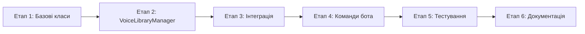

# VoiceLibraryManager - План Імплементації

## Огляд

Цей документ описує покроковий план імплементації VoiceLibraryManager для вирішення проблеми консистентності голосу у VIBEMODLY.

### Проблема
- Reference аудіо створюється з ПЕРШОГО згенерованого аудіо (може бути 1-2 секунди)
- Немає персистентності між сесіями Colab
- Якість залежить від випадкового тексту

### Рішення
- Створення canonical reference аудіо (15-20 сек) для кожного персонажа
- Збереження на Google Drive
- Система валідації якості

---

## Етап 1: Створення базових класів

### 1.1 Файл voice_library_manager.py

**Створити новий файл** з наступною структурою:

```
voice_library_manager.py
├── Імпорти
├── ReferenceQualityMetrics (class)
├── VoiceLibraryEntry (dataclass)
├── VoiceLibraryManager (class)
└── Експорт
```

### 1.2 Клас ReferenceQualityMetrics

```python
class ReferenceQualityMetrics:
    """Метрики якості reference аудіо."""
    
    # Тривалість
    DURATION_OPTIMAL_MIN = 15.0
    DURATION_OPTIMAL_MAX = 20.0
    DURATION_ABSOLUTE_MIN = 10.0
    DURATION_ABSOLUTE_MAX = 30.0
    
    # RMS рівень
    RMS_MIN = 0.02
    RMS_MAX = 0.30
    RMS_OPTIMAL = 0.10
    
    # Кліпінг
    CLIP_THRESHOLD = 0.98
    CLIP_MAX_SAMPLES = 10
    
    # Динамічний діапазон
    DYNAMIC_RANGE_MIN = 0.1
    SILENCE_RATIO_MAX = 0.15
```

### 1.3 Клас VoiceLibraryEntry

```python
@dataclass
class VoiceLibraryEntry:
    """Запис у бібліотеці голосів."""
    
    character_name: str
    voice_preset: str
    reference_audio_path: str
    reference_text: str
    duration: float
    quality_score: float
    created_at: str
    updated_at: str
    metadata: Dict[str, Any] = field(default_factory=dict)
```

---

## Етап 2: Реалізація VoiceLibraryManager

### 2.1 Конструктор та ініціалізація

```python
class VoiceLibraryManager:
    DRIVE_BASE_PATH = "/content/drive/MyDrive/vibemodly_voices"
    LIBRARY_FILE = "voice_library.json"
    REFERENCE_DIR = "references"
    
    def __init__(
        self,
        voice_clone_engine: VoiceCloneEngine,
        voice_design_engine: VoiceDesignEngine,
        cache: Optional[VoicePromptCache] = None,
        drive_path: Optional[str] = None
    ):
        self._engine_clone = voice_clone_engine
        self._engine_design = voice_design_engine
        self._cache = cache
        self._drive_path = drive_path or self.DRIVE_BASE_PATH
        self._library: Dict[str, VoiceLibraryEntry] = {}
        self._created_at = datetime.now().isoformat()
```

### 2.2 Основні методи

| Метод | Опис | Пріоритет |
|-------|------|-----------|
| `get_voice()` | Отримання voice_prompt для персонажа | Високий |
| `create_canonical_reference()` | Створення reference аудіо 15-20 сек | Високий |
| `validate_reference()` | Валідація якості аудіо | Високий |
| `save_library()` | Збереження на Google Drive | Високий |
| `load_library()` | Завантаження з Google Drive | Високий |
| `list_voices()` | Список всіх голосів | Середній |
| `get_entry()` | Отримання запису персонажа | Середній |
| `delete_voice()` | Видалення голосу | Середній |
| `update_voice()` | Оновлення голосу | Середній |
| `sync_with_drive()` | Синхронізація з Drive | Низький |

---

## Етап 3: Інтеграція з vibemodly_colab.py

### 3.1 Глобальні змінні

Додати після рядка 193:

```python
# Глобальна змінна для VoiceLibraryManager
voice_library = None
```

### 3.2 Функція init_voice_library()

Додати після `load_voice_configs()`:

```python
def init_voice_library():
    """Ініціалізація VoiceLibraryManager."""
    global voice_library, tts_model_base, tts_model_voicedesign
    
    if voice_library is not None:
        return voice_library
    
    # Створення двигунів
    from voicebox_adapter_colab import VoiceCloneEngine, VoiceDesignEngine
    
    clone_engine = VoiceCloneEngine()
    design_engine = VoiceDesignEngine()
    
    # Встановлення моделей
    if tts_model_base is not None:
        clone_engine.set_model(tts_model_base)
    if tts_model_voicedesign is not None:
        design_engine.set_model(tts_model_voicedesign)
    
    # Створення менеджера
    from voice_library_manager import VoiceLibraryManager
    
    voice_library = VoiceLibraryManager(
        voice_clone_engine=clone_engine,
        voice_design_engine=design_engine,
        drive_path="/content/drive/MyDrive/vibemodly_voices"
    )
    
    # Завантаження бібліотеки
    voice_library.load_library()
    
    return voice_library
```

### 3.3 Модифікація generate_audio()

Додати параметр `use_library=True` та нову логіку:

```python
def generate_audio(
    text,
    voice_desc="",
    lang="russian",
    character_name="narrator",
    gender="male",
    voice_preset=None,
    speed=1.0,
    custom_seed=None,
    use_voice_clone=True,
    use_library=True  # НОВИЙ ПАРАМЕТР
):
    global tts_model_voicedesign, tts_model_base, character_voice_params
    global character_voice_prompts, voice_library
    
    # === НОВИЙ ПІДХІД З VOICE LIBRARY ===
    if use_library and use_voice_clone and tts_model_base is not None:
        if voice_library is None:
            init_voice_library()
        
        voice_prompt, is_new = voice_library.get_voice(
            character_name=character_name,
            voice_preset=voice_preset or "male_deep",
            gender=gender,
            language=lang
        )
        
        if voice_prompt is not None:
            # Генерація через VoiceClone
            ...
    
    # === FALLBACK НА СТАРИЙ ПІДХІД ===
    else:
        # Існуюча логіка
        ...
```

---

## Етап 4: Команди бота

### 4.1 Команда /library

```python
@self.bot.message_handler(commands=['library'])
def library_cmd(m):
    """Управління бібліотекою голосів."""
    if voice_library is None:
        self.bot.reply_to(m, "❌ Бібліотека не ініціалізована")
        return
    
    voices = voice_library.list_voices()
    
    text = "📚 Бібліотека голосів:\n\n"
    for entry in voices:
        quality = entry.quality_score
        quality_emoji = "🟢" if quality >= 0.8 else "🟡" if quality >= 0.6 else "🔴"
        text += f"{quality_emoji} {entry.character_name}\n"
        text += f"   • Пресет: {entry.voice_preset}\n"
        text += f"   • Тривалість: {entry.duration:.1f}с\n"
        text += f"   • Якість: {quality:.0%}\n\n"
    
    self.bot.reply_to(m, text)
```

### 4.2 Команда /library_refresh

```python
@self.bot.message_handler(commands=['library_refresh'])
def library_refresh_cmd(m):
    """Перегенерація reference для голосу."""
    # Парсинг аргументів
    args = m.text.split(maxsplit=1)
    if len(args) < 2:
        self.bot.reply_to(m, "Використання: /library_refresh <ім'я_персонажа>")
        return
    
    character_name = args[1].strip()
    # ...
```

### 4.3 Команда /library_sync

```python
@self.bot.message_handler(commands=['library_sync'])
def library_sync_cmd(m):
    """Синхронізація з Google Drive."""
    if voice_library is None:
        self.bot.reply_to(m, "❌ Бібліотека не ініціалізована")
        return
    
    stats = voice_library.sync_with_drive()
    
    text = "🔄 Синхронізація завершена:\n"
    text += f"• Додано: {stats['added']}\n"
    text += f"• Завантажено: {stats['downloaded']}\n"
    text += f"• Оновлено: {stats['updated']}\n"
    
    self.bot.reply_to(m, text)
```

---

## Етап 5: Тестування

### 5.1 Структура тестів

```
tests/
└── test_voice_library_manager.py
    ├── TestVoiceLibraryEntry
    │   ├── test_entry_creation
    │   └── test_entry_serialization
    ├── TestVoiceLibraryManager
    │   ├── test_init
    │   ├── test_save_and_load_library
    │   ├── test_list_voices
    │   └── test_delete_voice
    └── TestValidation
        ├── test_validate_duration
        ├── test_validate_rms
        └── test_calculate_quality_score
```

### 5.2 Запуск тестів

```bash
# Всі тести
pytest tests/test_voice_library_manager.py

# З покриттям
pytest tests/ --cov=voice_library_manager --cov-report=html
```

---

## Етап 6: Документація

### 6.1 Docstrings

Всі класи та методи повинні мати docstrings у форматі Google Style:

```python
def get_voice(
    self,
    character_name: str,
    voice_preset: str,
    gender: str = "male",
    language: str = "russian"
) -> Tuple[Optional[Dict[str, Any]], bool]:
    """
    Отримання voice_prompt для персонажа.
    
    Якщо reference ще не існує - створює canonical reference.
    
    Args:
        character_name: Ім'я персонажа
        voice_preset: Ключ пресету з VOICE_PRESETS
        gender: Стать для VoiceDesign
        language: Мова
        
    Returns:
        Tuple[voice_prompt, is_new]: voice_prompt та прапорець чи щойно створено
        
    Example:
        >>> prompt, is_new = manager.get_voice("Анна", "female_soft")
        >>> print(f"Новий: {is_new}")
    """
```

---

## Послідовність виконання



## Залежності між завданнями

| Завдання | Залежить від |
|----------|--------------|
| VoiceLibraryManager | ReferenceQualityMetrics, VoiceLibraryEntry |
| Інтеграція | VoiceLibraryManager |
| Команди бота | Інтеграція |
| Тести | Всі попередні |

---

## Оцінка складності

| Етап | Складність | Файли |
|------|------------|-------|
| Етап 1 | Низька | voice_library_manager.py |
| Етап 2 | Висока | voice_library_manager.py |
| Етап 3 | Середня | vibemodly_colab.py |
| Етап 4 | Низька | vibemodly_colab.py |
| Етап 5 | Середня | tests/test_voice_library_manager.py |
| Етап 6 | Низька | voice_library_manager.py |

---

## Готово до імплементації

Після затвердження цього плану, переключитися в режим **Code** для початку імплементації.

### Рекомендований порядок дій:

1. ✅ Створити `voice_library_manager.py` з класами `ReferenceQualityMetrics` та `VoiceLibraryEntry`
2. ✅ Реалізувати `VoiceLibraryManager` з усіма методами
3. ✅ Інтегрувати в `vibemodly_colab.py`
4. ✅ Додати команди бота
5. ✅ Написати тести
6. ✅ Документувати API
