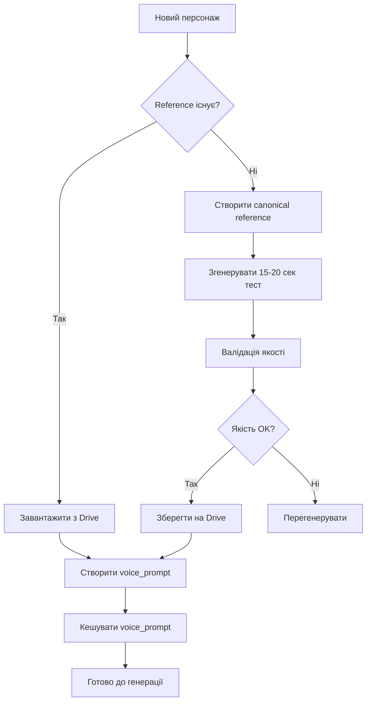
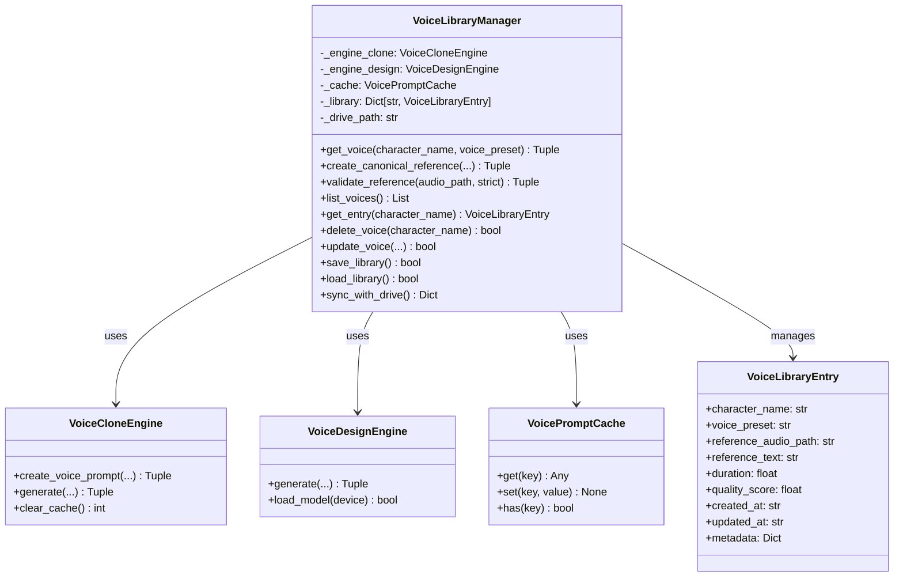
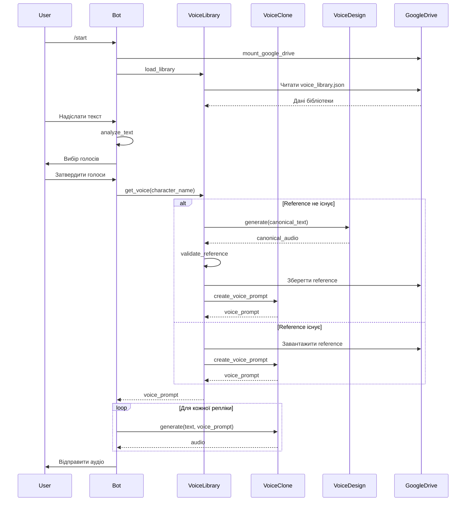

# VoiceLibraryManager - Архітектурний План

## Зміст
1. [Вступ](#вступ)
2. [Аналіз існуючого коду](#аналіз-існуючого-коду)
3. [Архітектура VoiceLibraryManager](#архітектура-voicelibrarymanager)
4. [Схема даних](#схема-даних)
5. [Інтерфейс Google Drive](#інтерфейс-google-drive)
6. [Система валідації](#система-валідації)
7. [План інтеграції](#план-інтеграції)
8. [Приклади використання](#приклади-використання)
9. [Тестування](#тестування)

---

## Вступ

### Проблема

Поточна реалізація VIBEMODLY має проблему з консистентністю голосу між репліками персонажів:

```python
# Поточний підхід - глобальний словник
character_voice_prompts = {}  # {character_name: {"voice_prompt": dict, ...}}

# Проблеми:
# 1. Reference аудіо створюється з ПЕРШОГО згенерованого аудіо
# 2. Перший текст може бути коротким (1-2 секунди) - недостатньо для якісного клонування
# 3. Немає персистентності між сесіями Colab
# 4. Якість залежить від випадкового тексту
```

**Наслідки:**
- Низька якість клонування через короткі reference семпли
- Втрата голосів при перезапуску Colab
- Непередбачувана якість голосу

### Рішення: VoiceLibraryManager

**Гібридний підхід:**

1. **Створення canonical reference аудіо** (15-20 сек) для кожного персонажа
2. **Збереження на Google Drive** для персистентності
3. **Використання ТІЛЬКИ VoiceClone** для всіх генерацій
4. **Система валідації якості** reference аудіо



---

## Аналіз існуючого коду

### Ключові класи

#### VoiceMode (Enum)
```python
class VoiceMode(Enum):
    VOICE_DESIGN = "voicedesign"  # seed + prompt
    VOICE_CLONE = "clone"          # reference audio
```
**Файл:** [`voicebox_adapter_colab.py:47`](voicebox_adapter_colab.py:47)

#### VoicePromptCache
```python
class VoicePromptCache:
    def __init__(self, cache_dir: str = "/content/cache"):
        # Двохрівневе кешування: memory + disk
    
    def get(self, key: str) -> Optional[Any]
    def set(self, key: str, value: Any, save_to_disk: bool = True)
    def has(self, key: str) -> bool
    def delete(self, key: str) -> bool
    def clear() -> None
    def get_stats() -> Dict[str, Any]
```
**Файл:** [`voicebox_adapter_colab.py:275`](voicebox_adapter_colab.py:275)

#### VoiceProfile (dataclass)
```python
@dataclass
class VoiceProfile:
    id: str
    name: str
    mode: VoiceMode = VoiceMode.VOICE_DESIGN
    seed: Optional[int] = None
    prompt: Optional[str] = None
    reference_audio_path: Optional[str] = None
    reference_text: Optional[str] = None
    gender: str = "male"
    language: str = "russian"
    speed: float = 1.0
    pitch: str = "medium"
    description: str = ""
    tags: List[str] = field(default_factory=list)
    
    def to_engine_config() -> Dict[str, Any]
    def to_dict() -> Dict[str, Any]
    @classmethod
    def from_dict(cls, data: Dict) -> 'VoiceProfile'
```
**Файл:** [`voicebox_adapter_colab.py:585`](voicebox_adapter_colab.py:585)

#### VoiceProfileManager
```python
class VoiceProfileManager:
    def get_profile(character_name: str, voice_preset: Optional[str]) -> VoiceProfile
    def create_profile(profile: VoiceProfile) -> None
    def update_profile(profile: VoiceProfile) -> None
    def delete_profile(profile_id: str) -> bool
    def get_all_profiles() -> List[VoiceProfile]
    def save_profiles(filepath: str) -> bool
    def load_profiles(filepath: str) -> bool
    def create_clone_profile(...) -> VoiceProfile
```
**Файл:** [`voicebox_adapter_colab.py:773`](voicebox_adapter_colab.py:773)

#### VoiceCloneEngine
```python
class VoiceCloneEngine(TTSEngine):
    def create_voice_prompt(
        reference_audio_path: str,
        reference_text: str,
        use_cache: bool = True,
        validate: bool = True
    ) -> Tuple[Optional[Dict], bool]
    
    def generate(text: str, voice_config: Dict, language: str) -> Tuple[Optional[np.ndarray], int]
    def combine_voice_prompts(audio_paths: List[str], texts: List[str]) -> Tuple[np.ndarray, str]
    def clear_cache() -> int
```
**Файл:** [`voicebox_adapter_colab.py:1300`](voicebox_adapter_colab.py:1300)

### Функції валідації

```python
def validate_reference_audio(
    audio_path: str,
    min_duration: float = 2.0,    # МІНІМУМ 2 секунди
    max_duration: float = 30.0,   # МАКСИМУМ 30 секунд
    min_rms: float = 0.01         # Мінімальний рівень гучності
) -> Tuple[bool, Optional[str]]

def load_audio_for_voice_clone(
    audio_path: str,
    sample_rate: int = 24000,
    mono: bool = True,
    normalize: bool = True
) -> Tuple[np.ndarray, int]

def get_cache_key(audio_path: str, reference_text: str) -> str
```
**Файл:** [`voicebox_adapter_colab.py:84`](voicebox_adapter_colab.py:84)

### Google Drive інтеграція

```python
VOICE_CONFIG_PATH = "/content/drive/MyDrive/vibemodly_voices.json"

def mount_google_drive() -> bool
def load_voice_configs()  # Завантажує VOICE_PRESETS з Drive
def save_voice_configs()  # Зберігає VOICE_PRESETS на Drive
```
**Файл:** [`vibemodly_colab.py:1806`](vibemodly_colab.py:1806)

---

## Архітектура VoiceLibraryManager

### Огляд класу

```python
@dataclass
class VoiceLibraryEntry:
    """Запис у бібліотеці голосів."""
    character_name: str
    voice_preset: str              # Ключ з VOICE_PRESETS
    reference_audio_path: str      # Шлях до canonical reference
    reference_text: str            # Текст reference аудіо
    duration: float                # Тривалість в секундах
    quality_score: float           # Оцінка якості (0.0-1.0)
    created_at: str                # ISO timestamp
    updated_at: str                # ISO timestamp
    metadata: Dict[str, Any]       # Додаткові метадані


class VoiceLibraryManager:
    """
    Менеджер бібліотеки голосів з персистентністю на Google Drive.
    
    Відповідальності:
    1. Створення canonical reference аудіо для персонажів
    2. Збереження/завантаження з Google Drive
    3. Валідація якості reference аудіо
    4. Інтеграція з VoiceCloneEngine
    """
    
    # Константи
    OPTIMAL_DURATION_MIN = 15.0    # Оптимальна мінімальна тривалість
    OPTIMAL_DURATION_MAX = 20.0    # Оптимальна максимальна тривалість
    MIN_DURATION = 10.0            # Абсолютний мінімум
    MAX_DURATION = 30.0            # Абсолютний максимум
    
    DRIVE_BASE_PATH = "/content/drive/MyDrive/vibemodly_voices"
    LIBRARY_FILE = "voice_library.json"
    REFERENCE_DIR = "references"
```

### Методи класу

```python
class VoiceLibraryManager:
    def __init__(
        self,
        voice_clone_engine: VoiceCloneEngine,
        voice_design_engine: VoiceDesignEngine,
        cache: Optional[VoicePromptCache] = None,
        drive_path: Optional[str] = None
    ):
        """
        Ініціалізація менеджера.
        
        Args:
            voice_clone_engine: Двигун для клонування голосу
            voice_design_engine: Двигун для створення голосу (для canonical reference)
            cache: Кеш для voice prompts (опціонально)
            drive_path: Шлях до Google Drive (опціонально)
        """
    
    # === ОСНОВНІ МЕТОДИ ===
    
    def get_voice(
        self,
        character_name: str,
        voice_preset: str,
        gender: str = "male",
        language: str = "russian"
    ) -> Tuple[Optional[Dict[str, Any]], bool]:
        """
        Отримання voice_prompt для персонажа.
        
        Якщо reference ще не існує - створює canonical reference.
        
        Args:
            character_name: Ім'я персонажа
            voice_preset: Ключ пресету з VOICE_PRESETS
            gender: Стать для VoiceDesign
            language: Мова
            
        Returns:
            Tuple[voice_prompt, is_new]: voice_prompt та прапорець чи щойно створено
        """
    
    def create_canonical_reference(
        self,
        character_name: str,
        voice_preset: str,
        gender: str = "male",
        language: str = "russian",
        custom_text: Optional[str] = None
    ) -> Tuple[Optional[str], Optional[str]]:
        """
        Створення canonical reference аудіо (15-20 сек).
        
        Args:
            character_name: Ім'я персонажа
            voice_preset: Ключ пресету
            gender: Стать
            language: Мова
            custom_text: Власний текст для reference (опціонально)
            
        Returns:
            Tuple[audio_path, reference_text]: Шлях до аудіо та текст
        """
    
    def validate_reference(
        self,
        audio_path: str,
        strict: bool = False
    ) -> Tuple[bool, Optional[str], float]:
        """
        Валідація reference аудіо.
        
        Args:
            audio_path: Шлях до аудіо файлу
            strict: Сувора валідація (оптимальна тривалість)
            
        Returns:
            Tuple[is_valid, error_message, quality_score]
        """
    
    # === УПРАВЛІННЯ БІБЛІОТЕКОЮ ===
    
    def list_voices(self) -> List[VoiceLibraryEntry]:
        """Отримання списку всіх голосів у бібліотеці."""
    
    def get_entry(self, character_name: str) -> Optional[VoiceLibraryEntry]:
        """Отримання запису для персонажа."""
    
    def delete_voice(self, character_name: str) -> bool:
        """Видалення голосу з бібліотеки."""
    
    def update_voice(
        self,
        character_name: str,
        voice_preset: Optional[str] = None,
        custom_text: Optional[str] = None
    ) -> bool:
        """Оновлення голосу персонажа."""
    
    # === PERSISTENCE ===
    
    def save_library(self) -> bool:
        """Збереження бібліотеки на Google Drive."""
    
    def load_library(self) -> bool:
        """Завантаження бібліотеки з Google Drive."""
    
    def sync_with_drive(self) -> Dict[str, int]:
        """
        Синхронізація з Google Drive.
        
        Returns:
            Dict з кількістю доданих/оновлених/видалених голосів
        """
    
    # === ДОПОМІЖНІ МЕТОДИ ===
    
    def _generate_reference_text(
        self,
        language: str = "russian",
        target_duration: float = 17.5
    ) -> str:
        """
        Генерація тексту для canonical reference.
        
        Текст розрахований на ~17.5 секунд озвучення.
        """
    
    def _calculate_quality_score(
        self,
        audio: np.ndarray,
        sample_rate: int
    ) -> float:
        """
        Розрахунок оцінки якості аудіо.
        
        Критерії:
        - Тривалість (оптимально 15-20 сек)
        - RMS рівень (не занадто тихий/гучний)
        - Відсутність кліпінгу
        - Динамічний діапазон
        """
    
    def _get_reference_path(self, character_name: str) -> str:
        """Отримання шляху для збереження reference аудіо."""
```

### Діаграма класів



---

## Схема даних

### Структура JSON файлу бібліотеки

**Файл:** `/content/drive/MyDrive/vibemodly_voices/voice_library.json`

```json
{
  "version": "1.0.0",
  "created_at": "2026-02-21T10:00:00Z",
  "updated_at": "2026-02-21T12:30:00Z",
  "entries": {
    "narrator": {
      "character_name": "narrator",
      "voice_preset": "narrator_neutral",
      "reference_audio_path": "references/narrator_ref.wav",
      "reference_text": "Привіт! Це тестовий фрагмент голосу для визначення його характеристик. Я можу озвучувати ваші історії з різними емоціями та інтонаціями.",
      "duration": 17.5,
      "quality_score": 0.92,
      "created_at": "2026-02-21T10:00:00Z",
      "updated_at": "2026-02-21T10:00:00Z",
      "metadata": {
        "gender": "male",
        "language": "russian",
        "seed": 3001,
        "prompt": "Professional narrator voice. Clear and engaging storytelling."
      }
    },
    "Анна": {
      "character_name": "Анна",
      "voice_preset": "female_soft",
      "reference_audio_path": "references/anna_ref.wav",
      "reference_text": "Добрий день! Мене звати Анна. Я рада познайомитися з вами. Сподіваюсь, наша розмова буде цікавою та приємною.",
      "duration": 15.2,
      "quality_score": 0.88,
      "created_at": "2026-02-21T11:00:00Z",
      "updated_at": "2026-02-21T11:00:00Z",
      "metadata": {
        "gender": "female",
        "language": "ukrainian",
        "seed": 2001,
        "prompt": "Soft, gentle female voice. Warm and caring."
      }
    }
  },
  "statistics": {
    "total_voices": 2,
    "total_duration_sec": 32.7,
    "average_quality": 0.90
  }
}
```

### Структура директорій на Google Drive

```
/content/drive/MyDrive/vibemodly_voices/
├── voice_library.json          # Метадані бібліотеки
├── references/                  # Reference аудіо файли
│   ├── narrator_ref.wav
│   ├── anna_ref.wav
│   └── ...
├── cache/                       # Кеш voice_prompts (опціонально)
│   ├── abc123.prompt
│   └── ...
└── backup/                      # Резервні копії
    ├── voice_library_20260221_100000.json
    └── ...
```

### VoiceLibraryEntry Schema

```python
@dataclass
class VoiceLibraryEntry:
    """Запис у бібліотеці голосів."""
    
    # Обов'язкові поля
    character_name: str           # Унікальний ідентифікатор персонажа
    voice_preset: str             # Ключ з VOICE_PRESETS
    reference_audio_path: str     # Відносний шлях до reference аудіо
    reference_text: str           # Текст reference аудіо
    
    # Метрики якості
    duration: float               # Тривалість в секундах
    quality_score: float          # Оцінка якості (0.0-1.0)
    
    # Timestamps
    created_at: str               # ISO 8601
    updated_at: str               # ISO 8601
    
    # Додаткові дані
    metadata: Dict[str, Any] = field(default_factory=dict)
    # metadata може містити:
    # - gender: str
    # - language: str
    # - seed: int
    # - prompt: str
    # - rms_level: float
    # - dynamic_range: float
    # - custom_tags: List[str]
```

---

## Інтерфейс Google Drive

### Методи для роботи з Drive

```python
class VoiceLibraryManager:
    
    def _ensure_drive_mounted(self) -> bool:
        """
        Перевірка чи змонтовано Google Drive.
        
        Returns:
            bool: True якщо Drive доступний
        """
        if not os.path.exists("/content/drive/MyDrive"):
            try:
                from google.colab import drive
                drive.mount('/content/drive')
                return True
            except Exception as e:
                print(f"[VoiceLibrary] ❌ Не вдалося змонтувати Drive: {e}")
                return False
        return True
    
    def _ensure_directory_structure(self) -> bool:
        """
        Створення необхідної структури директорій.
        
        Returns:
            bool: True якщо структура створена/існує
        """
        dirs = [
            self._drive_path,
            os.path.join(self._drive_path, self.REFERENCE_DIR),
            os.path.join(self._drive_path, "cache"),
            os.path.join(self._drive_path, "backup")
        ]
        
        for dir_path in dirs:
            os.makedirs(dir_path, exist_ok=True)
        
        return True
    
    def save_library(self) -> bool:
        """
        Збереження бібліотеки на Google Drive.
        
        Returns:
            bool: True якщо збережено успішно
        """
        if not self._ensure_drive_mounted():
            return False
        
        self._ensure_directory_structure()
        
        library_path = os.path.join(self._drive_path, self.LIBRARY_FILE)
        
        # Створення backup перед збереженням
        if os.path.exists(library_path):
            self._create_backup(library_path)
        
        # Підготовка даних
        data = {
            "version": "1.0.0",
            "created_at": self._created_at,
            "updated_at": datetime.now().isoformat(),
            "entries": {
                name: entry.__dict__ 
                for name, entry in self._library.items()
            },
            "statistics": self._calculate_statistics()
        }
        
        # Збереження
        try:
            with open(library_path, "w", encoding="utf-8") as f:
                json.dump(data, f, ensure_ascii=False, indent=2)
            
            print(f"[VoiceLibrary] ✅ Збережено {len(self._library)} голосів")
            return True
            
        except Exception as e:
            print(f"[VoiceLibrary] ❌ Помилка збереження: {e}")
            return False
    
    def load_library(self) -> bool:
        """
        Завантаження бібліотеки з Google Drive.
        
        Returns:
            bool: True якщо завантажено успішно
        """
        if not self._ensure_drive_mounted():
            return False
        
        library_path = os.path.join(self._drive_path, self.LIBRARY_FILE)
        
        if not os.path.exists(library_path):
            print("[VoiceLibrary] 📭 Бібліотека не знайдена, створюємо нову")
            self._library = {}
            return True
        
        try:
            with open(library_path, "r", encoding="utf-8") as f:
                data = json.load(f)
            
            # Валідація версії
            version = data.get("version", "0.0.0")
            if version != "1.0.0":
                print(f"[VoiceLibrary] ⚠️ Версія {version}, може знадобитися міграція")
            
            # Завантаження записів
            self._library = {}
            for name, entry_data in data.get("entries", {}).items():
                self._library[name] = VoiceLibraryEntry(**entry_data)
            
            print(f"[VoiceLibrary] ✅ Завантажено {len(self._library)} голосів")
            return True
            
        except Exception as e:
            print(f"[VoiceLibrary] ❌ Помилка завантаження: {e}")
            return False
    
    def _create_backup(self, library_path: str) -> None:
        """Створення резервної копії бібліотеки."""
        timestamp = datetime.now().strftime("%Y%m%d_%H%M%S")
        backup_name = f"voice_library_{timestamp}.json"
        backup_path = os.path.join(self._drive_path, "backup", backup_name)
        
        try:
            import shutil
            shutil.copy2(library_path, backup_path)
            print(f"[VoiceLibrary] 💾 Backup створено: {backup_name}")
        except Exception as e:
            print(f"[VoiceLibrary] ⚠️ Не вдалося створити backup: {e}")
    
    def sync_with_drive(self) -> Dict[str, int]:
        """
        Двостороння синхронізація з Google Drive.
        
        Returns:
            Dict[str, int]: Статистика синхронізації
                - added: додано локальних голосів на Drive
                - downloaded: завантажено з Drive
                - updated: оновлено
                - deleted: видалено
        """
        stats = {"added": 0, "downloaded": 0, "updated": 0, "deleted": 0}
        
        # TODO: Реалізувати повну синхронізацію
        
        return stats
```

### Обробка помилок Google Drive

```python
class DriveSyncError(Exception):
    """Помилка синхронізації з Google Drive."""
    pass

class VoiceLibraryManager:
    
    def _handle_drive_error(self, operation: str, error: Exception) -> None:
        """
        Обробка помилок Google Drive.
        
        Args:
            operation: Назва операції
            error: Виняток
        """
        error_str = str(error).lower()
        
        if "quota" in error_str or "storage" in error_str:
            print(f"[VoiceLibrary] ❌ {operation}: Перевищено квоту Google Drive")
            # Можна запропонувати очищення старих backup
        
        elif "network" in error_str or "connection" in error_str:
            print(f"[VoiceLibrary] ❌ {operation}: Помилка мережі")
            # Можна спробувати пізніше
        
        elif "permission" in error_str or "access" in error_str:
            print(f"[VoiceLibrary] ❌ {operation}: Немає доступу до Google Drive")
            # Потрібна повторна авторизація
        
        else:
            print(f"[VoiceLibrary] ❌ {operation}: {error}")
```

---

## Система валідації

### Критерії якості reference аудіо

```python
class ReferenceQualityMetrics:
    """Метрики якості reference аудіо."""
    
    # Порогові значення
    DURATION_OPTIMAL_MIN = 15.0    # Оптимальний мінімум
    DURATION_OPTIMAL_MAX = 20.0    # Оптимальний максимум
    DURATION_ABSOLUTE_MIN = 10.0   # Абсолютний мінімум
    DURATION_ABSOLUTE_MAX = 30.0   # Абсолютний максимум
    
    RMS_MIN = 0.02                 # Мінімальний RMS (не занадто тихий)
    RMS_MAX = 0.30                 # Максимальний RMS (не занадто гучний)
    RMS_OPTIMAL = 0.10             # Оптимальний RMS
    
    CLIP_THRESHOLD = 0.98          # Поріг кліпінгу
    CLIP_MAX_SAMPLES = 10          # Макс. семплів на порозі
    
    DYNAMIC_RANGE_MIN = 0.1        # Мінімальний динамічний діапазон
    SILENCE_RATIO_MAX = 0.15       # Макс. співвідношення тиші


class VoiceLibraryManager:
    
    def validate_reference(
        self,
        audio_path: str,
        strict: bool = False
    ) -> Tuple[bool, Optional[str], float]:
        """
        Валідація reference аудіо.
        
        Args:
            audio_path: Шлях до аудіо файлу
            strict: Сувора валідація (використовує оптимальні значення)
            
        Returns:
            Tuple[is_valid, error_message, quality_score]
        """
        try:
            # Завантаження аудіо
            audio, sr = load_audio_for_voice_clone(audio_path)
            
            # 1. Перевірка тривалості
            duration = len(audio) / sr
            duration_ok, duration_msg = self._validate_duration(duration, strict)
            if not duration_ok:
                return False, duration_msg, 0.0
            
            # 2. Перевірка RMS рівня
            rms_ok, rms_msg, rms_score = self._validate_rms(audio)
            if not rms_ok:
                return False, rms_msg, 0.0
            
            # 3. Перевірка кліпінгу
            clip_ok, clip_msg, clip_score = self._validate_clipping(audio)
            if not clip_ok:
                return False, clip_msg, 0.0
            
            # 4. Перевірка динамічного діапазону
            dyn_ok, dyn_msg, dyn_score = self._validate_dynamic_range(audio)
            
            # 5. Перевірка тиші
            silence_ok, silence_msg, silence_score = self._validate_silence(audio, sr)
            
            # Розрахунок загальної оцінки
            quality_score = self._calculate_quality_score(
                duration=duration,
                rms_score=rms_score,
                clip_score=clip_score,
                dyn_score=dyn_score,
                silence_score=silence_score,
                strict=strict
            )
            
            return True, None, quality_score
            
        except Exception as e:
            return False, f"Помилка валідації: {e}", 0.0
    
    def _validate_duration(
        self,
        duration: float,
        strict: bool
    ) -> Tuple[bool, Optional[str]]:
        """Валідація тривалості."""
        metrics = ReferenceQualityMetrics
        
        if strict:
            min_dur = metrics.DURATION_OPTIMAL_MIN
            max_dur = metrics.DURATION_OPTIMAL_MAX
        else:
            min_dur = metrics.DURATION_ABSOLUTE_MIN
            max_dur = metrics.DURATION_ABSOLUTE_MAX
        
        if duration < min_dur:
            return False, f"Тривалість {duration:.1f}с занадто коротка. Мінімум: {min_dur}с"
        
        if duration > max_dur:
            return False, f"Тривалість {duration:.1f}с занадто довга. Максимум: {max_dur}с"
        
        return True, None
    
    def _validate_rms(
        self,
        audio: np.ndarray
    ) -> Tuple[bool, Optional[str], float]:
        """Валідація RMS рівня."""
        metrics = ReferenceQualityMetrics
        rms = np.sqrt(np.mean(audio**2))
        
        if rms < metrics.RMS_MIN:
            return False, f"Аудіо занадто тихе (RMS: {rms:.4f})", 0.0
        
        if rms > metrics.RMS_MAX:
            return False, f"Аудіо занадто гучне (RMS: {rms:.4f})", 0.0
        
        # Оцінка близькості до оптимального значення
        optimal = metrics.RMS_OPTIMAL
        score = 1.0 - abs(rms - optimal) / optimal
        
        return True, None, max(0.0, min(1.0, score))
    
    def _validate_clipping(
        self,
        audio: np.ndarray
    ) -> Tuple[bool, Optional[str], float]:
        """Валідація кліпінгу."""
        metrics = ReferenceQualityMetrics
        
        # Підрахунок семплів на порозі кліпінгу
        clip_count = np.sum(np.abs(audio) >= metrics.CLIP_THRESHOLD)
        
        if clip_count > metrics.CLIP_MAX_SAMPLES:
            return False, f"Виявлено кліпінг ({clip_count} семплів)", 0.0
        
        # Оцінка (менше кліпінгу = краще)
        score = 1.0 - (clip_count / metrics.CLIP_MAX_SAMPLES)
        
        return True, None, max(0.5, score)
    
    def _validate_dynamic_range(
        self,
        audio: np.ndarray
    ) -> Tuple[bool, Optional[str], float]:
        """Валідація динамічного діапазону."""
        metrics = ReferenceQualityMetrics
        
        # Розрахунок динамічного діапазону
        peak = np.max(np.abs(audio))
        rms = np.sqrt(np.mean(audio**2))
        
        if rms > 0:
            dynamic_range = peak / rms
        else:
            dynamic_range = 0
        
        if dynamic_range < metrics.DYNAMIC_RANGE_MIN:
            return False, f"Динамічний діапазон занадто малий: {dynamic_range:.2f}", 0.0
        
        # Оцінка (більший діапазон = краще, але не занадто)
        score = min(1.0, dynamic_range / 5.0)
        
        return True, None, score
    
    def _validate_silence(
        self,
        audio: np.ndarray,
        sr: int
    ) -> Tuple[bool, Optional[str], float]:
        """Валідація співвідношення тиші."""
        metrics = ReferenceQualityMetrics
        
        # Визначення тиші (семпли нижче порогу)
        silence_threshold = 0.01
        silence_samples = np.sum(np.abs(audio) < silence_threshold)
        silence_ratio = silence_samples / len(audio)
        
        if silence_ratio > metrics.SILENCE_RATIO_MAX:
            return False, f"Занадто багато тиші: {silence_ratio*100:.1f}%", 0.0
        
        # Оцінка (менше тиші = краще)
        score = 1.0 - silence_ratio
        
        return True, None, score
    
    def _calculate_quality_score(
        self,
        duration: float,
        rms_score: float,
        clip_score: float,
        dyn_score: float,
        silence_score: float,
        strict: bool
    ) -> float:
        """
        Розрахунок загальної оцінки якості.
        
        Ваги критеріїв:
        - Тривалість: 30%
        - RMS рівень: 25%
        - Відсутність кліпінгу: 20%
        - Динамічний діапазон: 15%
        - Відсутність тиші: 10%
        """
        metrics = ReferenceQualityMetrics
        
        # Оцінка тривалості
        if strict:
            optimal_min = metrics.DURATION_OPTIMAL_MIN
            optimal_max = metrics.DURATION_OPTIMAL_MAX
        else:
            optimal_min = metrics.DURATION_ABSOLUTE_MIN
            optimal_max = metrics.DURATION_ABSOLUTE_MAX
        
        optimal_mid = (optimal_min + optimal_max) / 2
        
        if duration < optimal_min:
            duration_score = duration / optimal_min
        elif duration > optimal_max:
            duration_score = optimal_max / duration
        else:
            # Чим ближче до середини оптимального діапазону, тим краще
            duration_score = 1.0 - abs(duration - optimal_mid) / optimal_mid
        
        # Зважена сума
        weights = {
            "duration": 0.30,
            "rms": 0.25,
            "clipping": 0.20,
            "dynamic": 0.15,
            "silence": 0.10
        }
        
        total_score = (
            weights["duration"] * duration_score +
            weights["rms"] * rms_score +
            weights["clipping"] * clip_score +
            weights["dynamic"] * dyn_score +
            weights["silence"] * silence_score
        )
        
        return round(total_score, 2)
```

### Рівні валідації

```python
class ValidationLevel(Enum):
    """Рівні валідації reference аудіо."""
    
    BASIC = "basic"        # Тільки критичні перевірки
    STANDARD = "standard"  # Стандартний набір перевірок
    STRICT = "strict"      # Суворі оптимальні значення


def validate_for_clone(
    audio_path: str,
    level: ValidationLevel = ValidationLevel.STANDARD
) -> Tuple[bool, Optional[str], float]:
    """
    Валідація reference аудіо для клонування.
    
    Args:
        audio_path: Шлях до аудіо файлу
        level: Рівень валідації
        
    Returns:
        Tuple[is_valid, error_message, quality_score]
    """
    # ... реалізація
```

---

## План інтеграції

### Крок 1: Створення VoiceLibraryManager

**Файл:** `voice_library_manager.py` (новий файл)

```python
# voice_library_manager.py
"""
Voice Library Manager - Персистентна бібліотека голосів для VIBEMODLY.

Цей модуль надає систему управління голосами персонажів з:
- Створення canonical reference аудіо (15-20 сек)
- Збереження на Google Drive
- Валідація якості reference
- Інтеграція з VoiceCloneEngine
"""

from voicebox_adapter_colab import (
    VoiceCloneEngine,
    VoiceDesignEngine,
    VoicePromptCache,
    VoiceProfile,
    validate_reference_audio,
    load_audio_for_voice_clone
)

# ... реалізація класу VoiceLibraryManager
```

### Крок 2: Модифікація generate_audio()

**Файл:** `vibemodly_colab.py`

```python
# Глобальна змінна для VoiceLibraryManager
voice_library = None

def init_voice_library():
    """Ініціалізація VoiceLibraryManager."""
    global voice_library
    
    if voice_library is not None:
        return voice_library
    
    # Створення двигунів
    clone_engine = VoiceCloneEngine()
    design_engine = VoiceDesignEngine()
    
    # Встановлення моделей
    if tts_model_base is not None:
        clone_engine.set_model(tts_model_base)
    if tts_model_voicedesign is not None:
        design_engine.set_model(tts_model_voicedesign)
    
    # Створення менеджера
    voice_library = VoiceLibraryManager(
        voice_clone_engine=clone_engine,
        voice_design_engine=design_engine,
        cache=voice_cache,
        drive_path="/content/drive/MyDrive/vibemodly_voices"
    )
    
    # Завантаження бібліотеки
    voice_library.load_library()
    
    return voice_library


def generate_audio(
    text,
    voice_desc="",
    lang="russian",
    character_name="narrator",
    gender="male",
    voice_preset=None,
    speed=1.0,
    custom_seed=None,
    use_voice_clone=True,
    use_library=True  # НОВИЙ ПАРАМЕТР
):
    """
    Генерація аудіо через Qwen3-TTS з підтримкою VoiceLibrary.
    
    АЛГОРИТМ (з use_library=True):
    1. Отримати voice_prompt з VoiceLibraryManager
    2. Якщо reference не існує - створити canonical reference
    3. Генерувати через VoiceClone
    
    Args:
        ... (існуючі параметри)
        use_library: Використовувати VoiceLibraryManager (за замовчуванням True)
    """
    global tts_model_voicedesign, tts_model_base, voice_library
    
    # === НОВИЙ ПІДХІД З VOICE LIBRARY ===
    if use_library and use_voice_clone and tts_model_base is not None:
        # Ініціалізація бібліотеки
        if voice_library is None:
            init_voice_library()
        
        # Отримання voice_prompt з бібліотеки
        voice_prompt, is_new = voice_library.get_voice(
            character_name=character_name,
            voice_preset=voice_preset or "male_deep",
            gender=gender,
            language=lang
        )
        
        if voice_prompt is not None:
            # Генерація через VoiceClone
            print(f"[TTS] === VOICE CLONE (Library) ===")
            print(f"[TTS] Персонаж: {character_name}")
            print(f"[TTS] Новий reference: {is_new}")
            
            # ... генерація через voice_prompt
            # (використовуємо tts_model_base.generate_voice_clone)
    
    # === FALLBACK НА СТАРИЙ ПІДХІД ===
    else:
        # Існуюча логіка generate_audio
        # ...
```

### Крок 3: Додавання команд бота

**Файл:** `vibemodly_colab.py`

```python
# У класі Bot

@self.bot.message_handler(commands=['library'])
def library_cmd(m):
    """Управління бібліотекою голосів."""
    if voice_library is None:
        self.bot.reply_to(m, "❌ Бібліотека не ініціалізована")
        return
    
    voices = voice_library.list_voices()
    
    text = "📚 Бібліотека голосів:\n\n"
    for entry in voices:
        quality = entry.quality_score
        quality_emoji = "🟢" if quality >= 0.8 else "🟡" if quality >= 0.6 else "🔴"
        text += f"{quality_emoji} {entry.character_name}\n"
        text += f"   • Пресет: {entry.voice_preset}\n"
        text += f"   • Тривалість: {entry.duration:.1f}с\n"
        text += f"   • Якість: {quality:.0%}\n\n"
    
    text += "\n/library_refresh - Оновити голос"
    text += "\n/library_delete <ім'я> - Видалити голос"
    
    self.bot.reply_to(m, text)

@self.bot.message_handler(commands=['library_refresh'])
def library_refresh_cmd(m):
    """Перегенерація reference для голосу."""
    # ... реалізація

@self.bot.message_handler(commands=['library_sync'])
def library_sync_cmd(m):
    """Синхронізація з Google Drive."""
    if voice_library is None:
        self.bot.reply_to(m, "❌ Бібліотека не ініціалізована")
        return
    
    stats = voice_library.sync_with_drive()
    
    text = "🔄 Синхронізація завершена:\n"
    text += f"• Додано: {stats['added']}\n"
    text += f"• Завантажено: {stats['downloaded']}\n"
    text += f"• Оновлено: {stats['updated']}\n"
    
    self.bot.reply_to(m, text)
```

### Крок 4: Модифікація _build_audio_with_voices()

**Файл:** `vibemodly_colab.py`

```python
def _build_audio_with_voices(self, scenario, char_map, status_cb, checkpoint_cb):
    """Збірка аудіо з використанням VoiceLibrary."""
    global voice_library
    
    # Ініціалізація бібліотеки
    if voice_library is None:
        init_voice_library()
    
    # ... існуючий код
    
    for scene_idx, scene in enumerate(scenes):
        # 1. Наратив
        narrative = scene.get("narrative", "")
        if narrative:
            # === ВИКОРИСТАННЯ VOICE LIBRARY ===
            voice_prompt, _ = voice_library.get_voice(
                character_name="narrator",
                voice_preset=narrator_preset,
                gender=narrator_gender,
                language=text_lang
            )
            
            if voice_prompt is not None:
                # Генерація через VoiceClone
                audio = generate_with_voice_prompt(narrative, voice_prompt, text_lang)
            else:
                # Fallback на VoiceDesign
                audio = generate_audio(...)
        
        # 2. Діалоги
        for dial in scene.get("dialogues", []):
            char = dial.get("character", "")
            # === ВИКОРИСТАННЯ VOICE LIBRARY ===
            voice_prompt, _ = voice_library.get_voice(
                character_name=char,
                voice_preset=char_info.get("voice_preset"),
                gender=char_info.get("gender", "male"),
                language=text_lang
            )
            
            # ... генерація
```

### Діаграма послідовності



---

## Приклади використання

### Базове використання

```python
# Ініціалізація
from voice_library_manager import VoiceLibraryManager
from voicebox_adapter_colab import VoiceCloneEngine, VoiceDesignEngine

# Створення двигунів
clone_engine = VoiceCloneEngine()
clone_engine.load_model()

design_engine = VoiceDesignEngine()
design_engine.load_model()

# Створення менеджера бібліотеки
library = VoiceLibraryManager(
    voice_clone_engine=clone_engine,
    voice_design_engine=design_engine,
    drive_path="/content/drive/MyDrive/vibemodly_voices"
)

# Завантаження існуючої бібліотеки
library.load_library()
```

### Отримання голосу для персонажа

```python
# Отримання voice_prompt для персонажа
# Якщо reference не існує - буде створено автоматично
voice_prompt, is_new = library.get_voice(
    character_name="Анна",
    voice_preset="female_soft",
    gender="female",
    language="ukrainian"
)

print(f"Voice prompt: {'новий' if is_new else 'з бібліотеки'}")

# Генерація аудіо
audio, sr = clone_engine.generate(
    text="Привіт! Мене звати Анна.",
    voice_config={"voice_prompt": voice_prompt, "speed": 1.0},
    language="ukrainian"
)
```

### Створення canonical reference вручну

```python
# Створення canonical reference з власним текстом
custom_text = """
Добрий день! Мене звати Анна. Я рада познайомитися з вами. 
Сподіваюсь, наша розмова буде цікавою та приємною.
Я люблю спілкуватися з людьми та дізнаватися нове.
"""

audio_path, ref_text = library.create_canonical_reference(
    character_name="Анна",
    voice_preset="female_soft",
    gender="female",
    language="ukrainian",
    custom_text=custom_text
)

print(f"Reference створено: {audio_path}")
print(f"Тривалість: {len(ref_text)} символів")
```

### Валідація reference аудіо

```python
# Валідація існуючого аудіо файлу
is_valid, error_msg, quality_score = library.validate_reference(
    audio_path="/path/to/reference.wav",
    strict=True  # Сувора валідація (оптимальні значення)
)

if is_valid:
    print(f"✅ Валідація пройдена! Оцінка якості: {quality_score:.0%}")
else:
    print(f"❌ Валідація не пройдена: {error_msg}")
```

### Управління бібліотекою

```python
# Список всіх голосів
voices = library.list_voices()
for entry in voices:
    print(f"{entry.character_name}: {entry.duration:.1f}с, якість {entry.quality_score:.0%}")

# Отримання конкретного запису
entry = library.get_entry("narrator")
if entry:
    print(f"Пресет: {entry.voice_preset}")
    print(f"Reference: {entry.reference_audio_path}")

# Видалення голосу
library.delete_voice("old_character")

# Збереження змін
library.save_library()
```

### Інтеграція з існуючим кодом VIBEMODLY

```python
# У vibemodly_colab.py

def generate_audio_with_library(
    text: str,
    character_name: str,
    voice_preset: str,
    gender: str = "male",
    language: str = "russian"
) -> Optional[np.ndarray]:
    """
    Генерація аудіо з використанням VoiceLibrary.
    
    Ця функція замінює поточний підхід з character_voice_prompts.
    """
    global voice_library, tts_model_base
    
    # Отримання voice_prompt
    voice_prompt, is_new = voice_library.get_voice(
        character_name=character_name,
        voice_preset=voice_preset,
        gender=gender,
        language=language
    )
    
    if voice_prompt is None:
        print(f"[TTS] ❌ Не вдалося отримати voice_prompt для {character_name}")
        return None
    
    # Генерація через VoiceClone
    if hasattr(tts_model_base, 'generate_voice_clone'):
        result = tts_model_base.generate_voice_clone(
            text=text,
            voice_clone_prompt=voice_prompt,
            instruct=None
        )
        
        if isinstance(result, tuple):
            wavs, sr = result
            audio = wavs[0] if isinstance(wavs, list) else wavs
        else:
            audio = result
            sr = SAMPLE_RATE
        
        if hasattr(audio, 'cpu'):
            audio = audio.cpu().numpy()
        
        return np.array(audio).flatten()
    
    return None
```

---

## Тестування

### Модульні тести

```python
# tests/test_voice_library_manager.py

import pytest
import numpy as np
from unittest.mock import Mock, patch, MagicMock
from voice_library_manager import (
    VoiceLibraryManager,
    VoiceLibraryEntry,
    ReferenceQualityMetrics
)


class TestVoiceLibraryEntry:
    """Тести для VoiceLibraryEntry."""
    
    def test_entry_creation(self):
        """Тест створення запису."""
        entry = VoiceLibraryEntry(
            character_name="test",
            voice_preset="male_deep",
            reference_audio_path="test.wav",
            reference_text="Test text",
            duration=15.0,
            quality_score=0.9,
            created_at="2026-01-01T00:00:00Z",
            updated_at="2026-01-01T00:00:00Z"
        )
        
        assert entry.character_name == "test"
        assert entry.quality_score == 0.9
    
    def test_entry_serialization(self):
        """Тест серіалізації/десеріалізації."""
        entry = VoiceLibraryEntry(
            character_name="test",
            voice_preset="male_deep",
            reference_audio_path="test.wav",
            reference_text="Test text",
            duration=15.0,
            quality_score=0.9,
            created_at="2026-01-01T00:00:00Z",
            updated_at="2026-01-01T00:00:00Z",
            metadata={"gender": "male"}
        )
        
        # Серіалізація
        data = entry.__dict__
        
        # Десеріалізація
        restored = VoiceLibraryEntry(**data)
        
        assert restored.character_name == entry.character_name
        assert restored.metadata["gender"] == "male"


class TestVoiceLibraryManager:
    """Тести для VoiceLibraryManager."""
    
    @pytest.fixture
    def mock_engines(self):
        """Мок двигунів."""
        clone_engine = Mock(spec=VoiceCloneEngine)
        design_engine = Mock(spec=VoiceDesignEngine)
        
        # Налаштування моків
        clone_engine.is_loaded.return_value = True
        design_engine.is_loaded.return_value = True
        
        return clone_engine, design_engine
    
    @pytest.fixture
    def manager(self, mock_engines, tmp_path):
        """Створення менеджера з тимчасовою директорією."""
        clone_engine, design_engine = mock_engines
        return VoiceLibraryManager(
            voice_clone_engine=clone_engine,
            voice_design_engine=design_engine,
            drive_path=str(tmp_path)
        )
    
    def test_init(self, manager):
        """Тест ініціалізації."""
        assert manager is not None
        assert manager._library == {}
    
    def test_save_and_load_library(self, manager, tmp_path):
        """Тест збереження та завантаження бібліотеки."""
        # Додавання запису
        entry = VoiceLibraryEntry(
            character_name="test",
            voice_preset="male_deep",
            reference_audio_path="test.wav",
            reference_text="Test",
            duration=15.0,
            quality_score=0.9,
            created_at="2026-01-01T00:00:00Z",
            updated_at="2026-01-01T00:00:00Z"
        )
        manager._library["test"] = entry
        
        # Збереження
        assert manager.save_library()
        
        # Очищення
        manager._library = {}
        
        # Завантаження
        assert manager.load_library()
        assert "test" in manager._library
        assert manager._library["test"].character_name == "test"
    
    def test_list_voices(self, manager):
        """Тест отримання списку голосів."""
        # Додавання записів
        for i in range(3):
            entry = VoiceLibraryEntry(
                character_name=f"char_{i}",
                voice_preset="male_deep",
                reference_audio_path=f"ref_{i}.wav",
                reference_text="Test",
                duration=15.0,
                quality_score=0.9,
                created_at="2026-01-01T00:00:00Z",
                updated_at="2026-01-01T00:00:00Z"
            )
            manager._library[f"char_{i}"] = entry
        
        voices = manager.list_voices()
        assert len(voices) == 3
    
    def test_delete_voice(self, manager):
        """Тест видалення голосу."""
        entry = VoiceLibraryEntry(
            character_name="to_delete",
            voice_preset="male_deep",
            reference_audio_path="del.wav",
            reference_text="Test",
            duration=15.0,
            quality_score=0.9,
            created_at="2026-01-01T00:00:00Z",
            updated_at="2026-01-01T00:00:00Z"
        )
        manager._library["to_delete"] = entry
        
        assert manager.delete_voice("to_delete")
        assert "to_delete" not in manager._library
        assert not manager.delete_voice("non_existent")


class TestValidation:
    """Тести валідації reference аудіо."""
    
    @pytest.fixture
    def manager(self):
        """Створення менеджера з мок двигунами."""
        return VoiceLibraryManager(
            voice_clone_engine=Mock(),
            voice_design_engine=Mock()
        )
    
    def test_validate_duration_too_short(self, manager):
        """Тест валідації занадто короткого аудіо."""
        ok, msg, score = manager._validate_duration(5.0, strict=False)
        assert not ok
        assert "занадто коротка" in msg.lower()
    
    def test_validate_duration_too_long(self, manager):
        """Тест валідації занадто довгого аудіо."""
        ok, msg, score = manager._validate_duration(35.0, strict=False)
        assert not ok
        assert "занадто довга" in msg.lower()
    
    def test_validate_duration_optimal(self, manager):
        """Тест валідації оптимальної тривалості."""
        ok, msg, score = manager._validate_duration(17.5, strict=True)
        assert ok
        assert msg is None
    
    def test_validate_rms_too_quiet(self, manager):
        """Тест валідації занадто тихого аудіо."""
        audio = np.random.randn(24000) * 0.001  # Дуже тихий
        ok, msg, score = manager._validate_rms(audio)
        assert not ok
        assert "тихе" in msg.lower()
    
    def test_validate_rms_optimal(self, manager):
        """Тест валідації оптимального RMS."""
        audio = np.random.randn(24000) * 0.1  # Оптимальний рівень
        ok, msg, score = manager._validate_rms(audio)
        assert ok
        assert score > 0.8
    
    def test_validate_clipping_detected(self, manager):
        """Тест виявлення кліпінгу."""
        audio = np.random.randn(24000)
        audio[:100] = 1.0  # Штучний кліпінг
        ok, msg, score = manager._validate_clipping(audio)
        assert not ok
        assert "кліпінг" in msg.lower()
    
    def test_calculate_quality_score(self, manager):
        """Тест розрахунку загальної оцінки."""
        score = manager._calculate_quality_score(
            duration=17.5,
            rms_score=0.9,
            clip_score=1.0,
            dyn_score=0.8,
            silence_score=0.95,
            strict=True
        )
        
        assert 0.0 <= score <= 1.0
        assert score > 0.8  # Висока якість


class TestIntegration:
    """Інтеграційні тести."""
    
    @pytest.mark.integration
    def test_full_workflow(self, tmp_path):
        """Тест повного робочого процесу."""
        # Мок двигунів
        clone_engine = Mock(spec=VoiceCloneEngine)
        design_engine = Mock(spec=VoiceDesignEngine)
        
        # Налаштування моків
        design_engine.generate.return_value = (
            np.random.randn(24000 * 17).astype(np.float32),
            24000
        )
        clone_engine.create_voice_prompt.return_value = (
            {"mock_prompt": True},
            False
        )
        
        # Створення менеджера
        manager = VoiceLibraryManager(
            voice_clone_engine=clone_engine,
            voice_design_engine=design_engine,
            drive_path=str(tmp_path)
        )
        
        # Отримання голосу (має створити canonical reference)
        voice_prompt, is_new = manager.get_voice(
            character_name="test_char",
            voice_preset="male_deep",
            gender="male",
            language="russian"
        )
        
        assert voice_prompt is not None
        assert is_new  # Новий reference
        
        # Повторне отримання (має взяти з бібліотеки)
        voice_prompt2, is_new2 = manager.get_voice(
            character_name="test_char",
            voice_preset="male_deep",
            gender="male",
            language="russian"
        )
        
        assert voice_prompt2 is not None
        assert not is_new2  # З бібліотеки
```

### Функціональні тести

```python
# tests/test_functional.py

import pytest
import numpy as np
from pydub import AudioSegment
import io


class TestFunctional:
    """Функціональні тести з реальними файлами."""
    
    @pytest.fixture
    def sample_audio(self, tmp_path):
        """Створення тестового аудіо файлу."""
        # Генерація тестового аудіо (17 секунд)
        duration_sec = 17
        sample_rate = 24000
        t = np.linspace(0, duration_sec, sample_rate * duration_sec)
        
        # Синусоїда з модуляцією
        audio = np.sin(2 * np.pi * 440 * t) * 0.1
        audio = audio.astype(np.float32)
        
        # Збереження
        audio_path = tmp_path / "test_reference.wav"
        audio_int16 = (audio * 32767).astype(np.int16)
        segment = AudioSegment(
            audio_int16.tobytes(),
            frame_rate=sample_rate,
            sample_width=2,
            channels=1
        )
        segment.export(str(audio_path), format="wav")
        
        return str(audio_path)
    
    def test_validate_real_audio(self, sample_audio, manager):
        """Тест валідації реального аудіо файлу."""
        is_valid, error_msg, quality_score = manager.validate_reference(
            sample_audio,
            strict=True
        )
        
        # Аудіо має пройти валідацію
        assert is_valid, f"Валідація не пройдена: {error_msg}"
        assert quality_score > 0.5
    
    @pytest.mark.slow
    def test_create_canonical_reference(self, manager):
        """Тест створення canonical reference."""
        # Потрібні реальні моделі
        pytest.skip("Потребує реальних моделей TTS")
```

### Запуск тестів

```bash
# Запуск всіх тестів
pytest tests/

# Запуск тільки модульних тестів
pytest tests/ -m "not integration and not slow"

# Запуск з покриттям коду
pytest tests/ --cov=voice_library_manager --cov-report=html

# Запуск конкретного тесту
pytest tests/test_voice_library_manager.py::TestValidation::test_validate_duration_optimal
```

---

## Резюме

### Ключові переваги VoiceLibraryManager

1. **Консистентність голосу**
   - Canonical reference аудіо оптимальної тривалості (15-20 сек)
   - Стабільна якість клонування для всіх реплік

2. **Персистентність**
   - Збереження на Google Drive
   - Автоматичне відновлення при рестарті Colab
   - Backup історія

3. **Валідація якості**
   - Автоматична оцінка якості reference
   - Попередження про проблеми (кліпінг, тиша, низька гучність)
   - Метрики якості для кожного голосу

4. **Інтеграція**
   - Мінімальні зміни в існуючому коді
   - Зворотна сумісність з VoiceDesign
   - Плавний перехід на новий підхід

### Наступні кроки

1. Реалізація `VoiceLibraryManager` у новому файлі
2. Модифікація `generate_audio()` для використання бібліотеки
3. Додавання команд бота для управління бібліотекою
4. Тестування на реальних даних
5. Документація API

---

*Версія документа: 1.0.0*
*Дата створення: 2026-02-21*
*Автор: VIBEMODLY Team*
